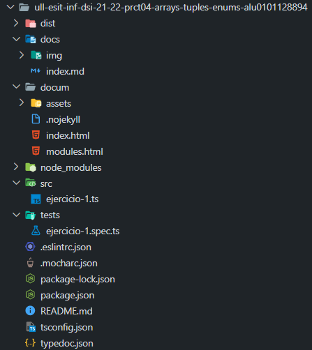
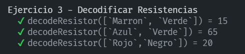
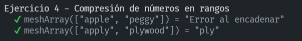
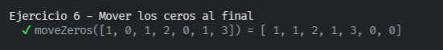
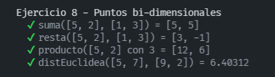
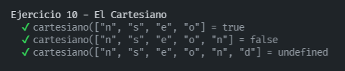

# Práctica 4 - Arrays, tuplas y enumerados

## 1. Introducción
Para esta cuarta práctica, se nos proponen **10 ejercicios** algo más complejos. En la que tenemos que realizar haciendo un uso con arrays, tuplas y enumerables. También se ha realizado el desarrollo dirigido por pruebas **(TDD)** y la generación automática con **Typedoc**.

## 2. Pasos
Antes de realizar nuestra práctica, reorganizaremos nuestro proyecto según la [Guía de creación de proyecto](https://ull-esit-inf-dsi-2122.github.io/typescript-theory/typescript-project-setup.html) que es el mismo proceso que ha sido llevado a cabo en la [práctica 3.](https://github.com/ULL-ESIT-INF-DSI-2122/ull-esit-inf-dsi-21-22-prct03-types-functions-alu0101128894) y modificaremos un poco la estructura del trabajo. Quedaría tal que así:



En toda nuestra práctica vamos a utilizar el **Typedoc**. Para instalarlo nos situaremos en la raíz del proyecto:

```
...$ npm install --save-dev typedoc
```

Una vez instalado, crearemos un fichero **typedoc.json** y escribimos estás líneas:
```
{
  "entryPoints": [
    "./src/ejercicio-1.ts",
    "./src/ejercicio-2.ts",
    "./src/ejercicio-3.ts",
    "./src/ejercicio-4.ts",
    "./src/ejercicio-5.ts",
    "./src/ejercicio-6.ts",
    "./src/ejercicio-7.ts",
    "./src/ejercicio-8.ts",
    "./src/ejercicio-9.ts",
    "./src/ejercicio-10.ts"
  ],
  "out": "./docum"
}
```
Esto quiere decir que en **entryPoints** se pondrá todos los ficheros en las que quiere que se genere la docuementación, como en este caso, tenemos 10 problemas, queremos que se genere los 10 problemas. Y en **out** agregamos el directorio de salida, en este caso **docum**. Cabe recalcar que tenemos otro directorio el **docs** que se usará para infomes en GHPages..

Para finalizar, añadimos una línea nueva en **package.json**
```
"docum": "typedoc"
```

Comentaremos el código haciendo un uso de *param, return, etc...*. Para ello, seguimos las indicaciones que nos ofrece la [Guía de Typedoc](https://typedoc.org/guides/installation/). Un ejemplo sobre ello sería:
```
/**
 * Comentario del ejercicio
 * @param (contenido) mensaje
 * @returns mensaje
 */
```

Una vez comentado todos los problemas, podemos ejecutar el Typedoc con este comando:
```
...$ npm run docum
```
Ahora realizaremos la instalación para **Mocha y Chai**, ejecutamos:
```
...$ npm install --save-dev mocha chai @types/mocha @types/chai ts-node
```

Creamos un fichero llamado **.mocharc.json** en la que agregamos lo siguiente:
```
{
  "extension": ["ts"],
  "spec": "tests/**/*.spec.ts",
  "require": "ts-node/register"
}
```
Creamos un directorio **tests** y dentro de ella agregaremos la estructura de pruebas como **ejercicio-X.spec.ts.** 
```
import 'mocha';
import {expect} from 'chai';
import {standard} from '../src/ejercicio-1';
```
En la tercera línea **{standard}** se deberá agregar el nombre de la funciones que contiene todo el fichero sin los corchetes. Cabe recalcar que en cada función debe estar precedida de un **export** antes de la función para que puedan ser accesibles.

Y para acabar, para ejecutar las pruebas agregaremos una nueva línea en **package.json**. Inicializandolo con `npm run test`.
```
"test": "mocha",
```

## 3. Ejercicios propuestos.

## Ejercicio 1 - Tablas de multiplicar

[Acceso al código del ejercicio 1.](https://github.com/ULL-ESIT-INF-DSI-2122/ull-esit-inf-dsi-21-22-prct04-arrays-tuples-enums-alu0101128894/blob/master/src/ejercicio-1.ts)

En este primer ejercicio nos pide crear una función `productTable` que reciba como parámetro un número N >= 1 y que devuelva un array de arrays con N tablas de multiplicar, donde cada tabla de multiplicar contiene los primeros N productos.

```ts
/**
 * Tablas de multiplicar
 * @param numero Array de números a incluir el parámetro con N tablas de multiplicar
 * @returns Devuelve la multiplicacion resultado final de la multiplicacion en formato cadena
 *  * ```ts
 * productTable(numero: number): number[][] | string
 * productTable(2)) = [[1, 2], [2, 4]]
 * ```
 */

export function productTable(numero: number): number[][] | string {
  let multiplicacion: number[][] = [];
  let auxMultiplicacion: number[] = [];
  let resultado: number[] = [];
  let valor: number = 0;
  let aux: number = 1;

  if (numero >= 1) { // devuelve n tablas de multiplicar
    for (let i = 0; i <= numero; i++) {
      auxMultiplicacion.push(i); // lo metemos
    }
    for (let i = 1; i <= auxMultiplicacion.length - 1; i++) { // bucle cadena
      while (aux <= numero) {
        valor = auxMultiplicacion[i] * aux; // multiplicamos todas las cadenas por una nueva
        resultado.push(valor); // lo metemos
        aux++; // aumentamos
      };
      multiplicacion.push(resultado); // guardamos
      resultado = []; // guardamos en []
      aux = 1;
    }
  }
  return multiplicacion; // devolvemos multiplicacion
}

console.log(productTable(2));
console.log(productTable(3));
console.log(productTable(4));
```
**EXPLICACIÓN**

> Tenemos una función `productTable` en la que recibimos como parámetro un número, y su salida del productable es un arrays de arrays o un string. Creamos una condicion para que N sean >= 1 y así podemos retornar los primeros n productos. Creamos un bucle que recorra toda la cadena con su longitud menores que 1 y mientras que el valor sea menores o iguales no incluye los valores.

> Multiplicamos todos los [i] valores por su auxiliar y hacemos un push para meterlo, e iteramos al siguiente valor. Guardamos el valor y lo metemos en un array de arrays manteniendo el valor auxiliar en 1 y retornamos la multiplicacion deseada.

[Acceso al código de pruebas (TDD) del ejercicio 1.](https://github.com/ULL-ESIT-INF-DSI-2122/ull-esit-inf-dsi-21-22-prct04-arrays-tuples-enums-alu0101128894/blob/master/tests/ejercicio-1.spec.ts)

**TESTS REALIZADOS**
```ts
import 'mocha';
import {expect} from 'chai';
import {productTable} from '../src/ejercicio-1';

describe('Ejercicio 1 - Tablas de multiplicar', () => {
  it('productTable(2) = [[1, 2], [2, 4]]', () => {
    expect(productTable(2)).to.be.eql([[1, 2], [2, 4]]);
  });
  it('productTable(3) = [[1, 2, 3], [2, 4, 6], [3, 6, 9]]', () => {
    expect(productTable(3)).to.be.eql([[1, 2, 3], [2, 4, 6], [3, 6, 9]]);
  });
  it('productTable(4) = [[1, 2, 3, 4], [2, 4, 6, 8], [3, 6, 9, 12], [4, 8, 12, 16]]', () => {
    expect(productTable(4)).to.be.eql([[1, 2, 3, 4], [2, 4, 6, 8], [3, 6, 9, 12], [4, 8, 12, 16]]);
  });
});
```
**SALIDA CORRECTAMENTE**


## Ejercicio 2 - Compresión de números en rangos

[Acceso al código del ejercicio 2.](https://github.com/ULL-ESIT-INF-DSI-2122/ull-esit-inf-dsi-21-22-prct04-arrays-tuples-enums-alu0101128894/blob/master/src/ejercicio-2.ts)

En este segundo ejercicio nos pide una función `fromArrayToRanges` que reciba un array o lista de números enteros y los comprima en rangos, es decir, que devuelva una cadena de caracteres con la compresión obtenida. Un rango, es decir, un conjunto de números consecutivos se representará mediante una cadena de caracteres con el primer y último número del rango separado por un guión bajo **(_)**. Un rango de un único número será la cadena de caracteres que representa a ese ùnico número. Luego, una serie de rangos vendrá separada por comas **(,)**.

Escriba una función fromRangesToArray que lleve a cabo la operación inversa, es decir, que reciba como argumento una cadena de caracteres representando una serie de rangos y devuelva el array de números correspondiente.

Ejemplo:

- 5, 6, 7, 9, 12, 13, 14] => ‘5_7, 9, 12_14’
- [-3, -2, -1, 3, 5, 6, 7] => i-3_-1, 3, 5_7’
- [17] => ‘17’
- [3, 5, 6, 7, 9, 10] => i3, 5_7, 9_10’

```ts

/**
 * __fromArrayToRanges__
 * @param cadena Array de cadenas de string
 * @returns devuelve el valor de array to ranges
 * ```ts
 * fromArrayToRanges(cadena: number[]): string
 * fromArrayToRanges([5, 6, 7, 9, 12, 13, 14]) = '5_7, 9, 12_14'
 * ```
 */

export function fromArrayToRanges(cadena: number[]): string {
  let resultado: string = '';
  let valorJ: number = 0;
  let valor2: number = 0;
  for (let i: number = 0; i < cadena.length; i++) { // recorre
    valorJ = i;
    let valor3: number = 0;
    let cadCompleta: string = cadena[i].toString(); // primero numero
    while ((valorJ < cadena.length - 1) && (cadena[valorJ + 1] == cadena[valorJ] + 1)) {
      valor3++; valorJ++; i++;
    }
    if (valor2 > 0) {
      resultado += ', ';
    }
    if (valor3 > 0) {
      resultado += cadCompleta + '_' + cadena[valorJ].toString(); // convertimos
    } else {
      resultado += cadCompleta;
    }
    valor2++; // actualizamos la coma
  }
  return resultado;
}

console.log(fromArrayToRanges([5, 6, 7, 9, 12, 13, 14]));
console.log(fromArrayToRanges([-3, -2, -1, 3, 5, 6, 7]));
console.log(fromArrayToRanges([17]));
console.log(fromArrayToRanges([3, 5, 6, 7, 9, 10]));

/**
 * __fromRangesToArray__
 * @param cadena Array de cadenas de string
 * @returns Devuelve del rango a string
 * ```ts
 * fromRangesToArray(cadena: string): number[]
 * fromRangesToArray("-3_-1, 3, 5_7") =  [5, 6, 7, 9, 12, 13, 14]
 * ```
 */

export function fromRangesToArray(cadena: string): number[] {
  const cadenaCompleta: string = cadena.replace(/ /g, '');
  const cadComas: string[] = cadenaCompleta.split(',');
  const restultado: number[] = [];

  for (let i: number = 0; i < cadComas.length; i++) {
    if (cadComas[i].includes('_')) { // dentro de _
      const n1: number = parseInt(cadComas[i].split('_')[0]);
      const n2: number = parseInt(cadComas[i].split('_')[1]);
      for (let i: number = n1; i <= n2; i++) {
        restultado.push(i);
      }
    } else {
      restultado.push(parseInt(cadComas[i])); // cambias a entero y resultado final
    }
  }
  return restultado;
}
console.log(fromRangesToArray("5_7, 9, 12_14"));
console.log(fromRangesToArray("-3_-1, 3, 5_7"));
console.log(fromRangesToArray("17"));
console.log(fromRangesToArray("3, 5_7, 9_10"));
```
**EXPLICACIÓN**

> En la primera función `fromArrayToRanges` en la que recibimos como parámetro un array de enteros, recorremos el vector y en cada elemento en **cadCompleta** comprobamos si la cadena son iguales *(cadena[valorJ + 1] == cadena[valorJ] + 1)*. Una vez comprobado, guardamos la ultima posición en **valorJ** y si llega el caso de que sean el mismo tamaño, guardamos ese número en el resultado de la cadena, y si fuese en caso contrario sería desde *cadCompleta hasta valorJ*

> En la segunda función `fromRangesToArray` es lo contrario a la primera función, es decir, que la cadena de entrada separado por **', '** e introducirlo en un vector, y para cada rango **cadena[i]** un tipo string. Para ello, comprobamos el carácter **'_'**, si es el caso de que lo tiene, lo convertimos en número y en un bucle metemos todos los números de ese rango permitido. En caso contrario, convertimos la cadena en un número y lo añadimos al propio vector resultante.

[Acceso al código de pruebas (TDD) del ejercicio 2.](https://github.com/ULL-ESIT-INF-DSI-2122/ull-esit-inf-dsi-21-22-prct04-arrays-tuples-enums-alu0101128894/blob/master/tests/ejercicio-2.spec.ts)

**TESTS REALIZADOS**
```ts
import 'mocha';
import {expect} from 'chai';
import {fromArrayToRanges} from '../src/ejercicio-2';
import {fromRangesToArray} from '../src/ejercicio-2';


describe('Ejercicio 2 - Compresión de números en rangos', () => {
  describe('fromArrayToRanges', () => {
    it('fromArrayToRanges([5, 6, 7, 9, 12, 13, 14]) = 5_7, 9, 12_14', () => {
      expect(fromArrayToRanges([5, 6, 7, 9, 12, 13, 14])).to.deep.equal('5_7, 9, 12_14');
    });
    it('fromArrayToRanges([-3, -2, -1, 3, 5, 6, 7]) = 5_7, 9, 12_14', () => {
      expect(fromArrayToRanges([-3, -2, -1, 3, 5, 6, 7])).to.deep.equal('-3_-1, 3, 5_7');
    });
    it('fromArrayToRanges([17]) = 17', () => {
      expect(fromArrayToRanges([17])).to.deep.equal('17');
    });
    it('fromArrayToRanges([3, 5, 6, 7, 9, 10]) = 3, 5_7, 9_10', () => {
      expect(fromArrayToRanges([3, 5, 6, 7, 9, 10])).to.deep.equal('3, 5_7, 9_10');
    });
  });
  describe('fromRangesToArray ', () => {
    it('fromRangesToArray ("5_7, 9, 12_14") = [5, 6, 7, 9, 12, 13, 14]', () => {
      expect(fromRangesToArray("5_7, 9, 12_14")).to.deep.equal([5, 6, 7, 9, 12, 13, 14]);
    });
    it('fromRangesToArray ("-3_-1, 3, 5_7") = [-3, -2, -1, 3, 5, 6, 7]', () => {
      expect(fromRangesToArray("-3_-1, 3, 5_7")).to.deep.equal([-3, -2, -1, 3, 5, 6, 7]);
    });
    it('fromRangesToArray ("17") = [17]', () => {
      expect(fromRangesToArray("17")).to.deep.equal([17]);
    });
    it('fromRangesToArray ("3, 5_7, 9_10") = [3, 5, 6, 7, 9, 10]', () => {
      expect(fromRangesToArray("3, 5_7, 9_10")).to.deep.equal([3, 5, 6, 7, 9, 10]);
    });
  });
});
```
**SALIDA CORRECTAMENTE**


## Ejercicio 3 - Decodificar resistencias

[Acceso al código del ejercicio 3.](https://github.com/ULL-ESIT-INF-DSI-2122/ull-esit-inf-dsi-21-22-prct04-arrays-tuples-enums-alu0101128894/blob/master/src/ejercicio-3.ts)

En este tercer ejercicio nos pide crear una función **decodeResistor** que recibe como parámetros los nombres de los colores de una resistencia como entrada y devuelve un número de dos dígitos indicando el valor de la resistencia. La función deberá devover un número de dos dígitos incluso si recibe más de dos colores como parámetros. El número asociado a cada color es:
```
Negro: 0
Marrón: 1
Rojo: 2
Naranja: 3
Amarillo: 4
Verde: 5
Azul: 6
Violeta: 7
Gris: 8
Blanco: 9
``` 

```ts
/**
 * Decodificación Resistencias
 * @param coloresResistencias Array de colores Negro: 0 Marrón: 1 Rojo: 2 Naranja: 3 Amarillo: 4 Verde: 5 Azul: 6 Violeta: 7 Gris: 8 Blanco: 9
 * @returns parseInt(resultado) Devuelve los colores en entero
 * ```ts
 * decodeResistor(coloresResistencias: string[])
 * decodeResistor([`Azul`, `Verde`]) = 65
 * ```
 */

export function decodeResistor(coloresResistencias: string[]) {
  const colores: string[] = [`Negro`, `Marron`, `Rojo`, `Naranja`, `Amarillo`, `Verde`, `Azul`, `Violeta`, `Gris`, `Blanco`];
  let resultado: string = '';
  let contador: number = 0;

  coloresResistencias.forEach((sol) => {
    if (contador < 2) {
      resultado += colores.indexOf(sol).toString();
    }
    contador++;
  });
  return parseInt(resultado); // convierte la cadena en numero entero
};

console.log(`DecodeResistor: ${decodeResistor([`Azul`, `Verde`])}`);
console.log(`DecodeResistor: ${decodeResistor([`Rojo`, `Negro`])}`);
```
**EXPLICACIÓN**

> Tenemos una función `decodeResistor` en la que pasamos como parámetro una cadena de string, en la que recibe los colores de las resistencias. Creamos una cadena con los posibles colores e inicializamos una cadena que almacenará su solución correspondiente

> Por otro lado el `forEach` calcula el resultado y si el contador es más pequeño que 2, signfica que guardamos el índice que tiene el array el color. Una vez finalizado, convertimos la cadena en número entero con **parseInt** y hacemos return.

[Acceso al código de pruebas (TDD) del ejercicio 3.](https://github.com/ULL-ESIT-INF-DSI-2122/ull-esit-inf-dsi-21-22-prct04-arrays-tuples-enums-alu0101128894/blob/master/tests/ejercicio-3.spec.ts)

**TESTS REALIZADOS**
```ts
import 'mocha';
import {expect} from 'chai';
import {decodeResistor} from '../src/ejercicio-3';

describe('Ejercicio 3 - Decodificar Resistencias', () => {
  it('decodeResistor([`Marron`, `Verde`]) = 15', () => {
    expect(decodeResistor([`Marron`, `Verde`])).to.be.equal(15);
  });
  it('decodeResistor([`Azul`, `Verde`]) = 65', () => {
    expect(decodeResistor([`Azul`, `Verde`])).to.be.equal(65);
  });
  it('decodeResistor(["Rojo","Negro"]) = 20', () => {
    expect(decodeResistor([`Rojo`, `Negro`])).to.be.equal(20);
  });
});
```
**SALIDA CORRECTAMENTE**



## Ejercicio 4 - Palabras encadenadas en un array

[Acceso al código del ejercicio 4.](https://github.com/ULL-ESIT-INF-DSI-2122/ull-esit-inf-dsi-21-22-prct04-arrays-tuples-enums-alu0101128894/blob/master/src/ejercicio-4.ts)

En este cuarto ejercicio nos pide que dado un array que contiene exclusivamente cadenas de texto, comprobar que las palabras del array están encadenadas. Esto es, una o más letras del final de una cadena coinciden con el comienzo de la siguiente cadena del array.

```ts
/**
 * Palabras encadenadas
 * @param palabras Array de palabras encadenadas
 * @returns Devuelve las letras que encadenan
 * ```ts
 * meshArray (palabras :string[])
 * meshArray (['apple', 'peggy']) = Error al encadenar
 * ```
 */

export function meshArray(palabras: string[]) {
  let resultado: string = "";
  for (let i: number = 0; i < palabras.length - 1; i++) {
    let palabra1: string[] = palabras[i].split("");
    let palabra2: string[] = palabras[i + 1].split("");
    let palabraLenght: number = palabra1.length - 1;
    let contador: number = 0;

    while (palabraLenght > -1) {
      if (palabra1[palabraLenght] == palabra2[0]) {
        break;
      } else {
        palabraLenght--;
        contador++;
      }
    }
    for (let k: number = 0; k <= contador; k++) {
      if (palabra1[palabraLenght] != palabra2[k]) {
        return "Error al encadenar";
      } else {
        resultado += palabra1[palabraLenght];
      }
      palabraLenght++;
    }
  }
  return resultado;
}

console.log('"apple" and "peggy" = ' + meshArray(['apple', 'peggy']));
console.log('"apply" and "plywood" = ' + meshArray(['apply', 'plywood']));
```
**EXPLICACIÓN**

> En la función `meshArray` devuelve una palabra con tipo de dato string. Recorremos el array de entrada, y en cada iteración cogeremos los elementos de 2 en 2, es decir, la palabra1 y la palabra2. 

> Ahora cogeremos la primera letra de la segunda palabra y contaremos en la primera palabra (de alante hacia atrás hasta encontrar con una que coincida). 

> Ejemplo: apple y plywood (Segunda palabra (**p**lywood) (primera letra "p"). Primera palabra (ap**p**le) (tercera letra "p" contando hacia atrás de la letra).

> Aplicamos todos los movimientos hacia atrás y comprueba todas las palabras hasta que coincida letra a letra y concatenamos el resultado final.

[Acceso al código de pruebas (TDD) del ejercicio 4.](https://github.com/ULL-ESIT-INF-DSI-2122/ull-esit-inf-dsi-21-22-prct04-arrays-tuples-enums-alu0101128894/blob/master/tests/ejercicio-4.spec.ts)

**TESTS REALIZADOS**
```ts
import 'mocha';
import {expect} from 'chai';
import {meshArray} from '../src/ejercicio-4';

describe('Ejercicio 4 - Compresión de números en rangos', () => {
  it('meshArray(["apple", "peggy"]) = "Error al encadenar"', () => {
    expect(meshArray(['apple', 'peggy'])).to.be.equal('Error al encadenar');
  });
  it('meshArray(["apply", "plywood"]) = "ply"', () => {
    expect(meshArray(['apply', 'plywood'])).to.be.equal('ply');
  });
});
```
**SALIDA CORRECTAMENTE**


## Ejercicio 5 - Calcular la media y concatenar cadenas

[Acceso al código del ejercicio 5.](https://github.com/ULL-ESIT-INF-DSI-2122/ull-esit-inf-dsi-21-22-prct04-arrays-tuples-enums-alu0101128894/blob/master/src/ejercicio-5.ts)

En este quinto ejercicio nos pide una función `meanAndConcatenate` que reciba como parámetro un array que incluye caracteres de texto y números. La función deberá devolver como resultado un array con dos valores.

```ts
/**
 * __Calcular la media y concatenar cadenas__
 * @param cadena Cadena de entrada con números o letras.
 * @returns Una cadena donde el primer valor es la media de los valores numericos y en el segundo la concatenacion de todos los caracteres.
 * ```ts
 * meanAndConcatenate(cadena: (string | number)[])
 * meanAndConcatenate(meanAndConcatenate(['u', 6, 'd', 1, 'i', 'w', 6, 's', 't', 4, 'a', 6, 'g', 1, 2, 'w', 8, 'o', 2, 0])) = [3.6, 'udiwstagwo']
 * ```
 */

export function meanAndConcatenate(cadena: (string | number)[]) {
  let media: number = 0;
  let contador: number = 0;
  let palabra: string = '';
  let solucion: (string | number)[] = [];

  cadena.forEach((valor) => {
    if (typeof valor === "number") {
      media += valor;
      contador++;
    } else {
      palabra += valor;
    }
  });
  media = media / contador;
  solucion[0] = media;
  solucion[1] = palabra;
  return solucion;
}

console.log(meanAndConcatenate(['u', 6, 'd', 1, 'i', 'w', 6, 's', 't', 4, 'a', 6, 'g', 1, 2, 'w', 8, 'o', 2, 0]));
```
**EXPLICACIÓN**

> En la función `meanAndConcatenate` devuelve un string o una cadena de numeros. Accedemos con un **forEach** en cada posición del array y dentro de ella seleccionamos un bucle if en la que se comprueba el tipo de elemento para analizarlo. Si fuese el caso de un número calculamos el sumatorio y lo incrementamos en el contador para así saber cuanto se suman y en caso de que termine el bucle se divide por la cantidad para así obtener la media. 

> Para el otro caso, es decir, un string, hacemos un sumatorio, por lo que se irá añadiendo a una cadena juntando todas las palabras en una palabra. En la que se nos muestra una cadena de tamaño 2 y en su primer elemento será el resultado de la media y la segunda el resultado de la palabra.

[Acceso al código de pruebas (TDD) del ejercicio 5.](https://github.com/ULL-ESIT-INF-DSI-2122/ull-esit-inf-dsi-21-22-prct04-arrays-tuples-enums-alu0101128894/blob/master/tests/ejercicio-5.spec.ts)

**TESTS REALIZADOS**
```ts
import 'mocha';
import {expect} from 'chai';
import {meanAndConcatenate} from '../src/ejercicio-5';

describe('Ejercicio 4 - Compresión de números en rangos', () => {
  it('meanAndConcatenate["u", 6, "d", 1, "i", "w", 6, "s", "t", 4, "a", 6, "g", 1, 2, "w", 8, "o", 2, 0] = [3.6, "udiwstagwo"]', () => {
    expect(meanAndConcatenate(['u', 6, 'd', 1, 'i', 'w', 6, 's', 't', 4, 'a', 6, 'g', 1, 2, 'w', 8, 'o', 2, 0])).to.be.deep.equal([3.6, 'udiwstagwo']);
  });
});
```
**SALIDA CORRECTAMENTE**


## Ejercicio 6 - Mover los ceros al final

[Acceso al código del ejercicio 6.](https://github.com/ULL-ESIT-INF-DSI-2122/ull-esit-inf-dsi-21-22-prct04-arrays-tuples-enums-alu0101128894/blob/master/src/ejercicio-6.ts)

En este sexto ejercicio nos pide una función `moveZeros` que recibirá un array de números y deberá reotornar ese mismo array pero esta vez con todos los ceros desplazados al final del array. Un ejemplo de programa es:

Por ejemplo, ```moveZeros([1, 0, 1, 2, 0, 1, 3])``` devuelve ```[1, 1, 2, 1, 3, 0, 0].```

```ts
/**
 * __Mover los ceros al final__
 * @param cadena Cadena de numeros
 * @returns Devuelve el vector reordenado con los ceros al final
 * ```ts
 * moveZeros (cadena :number[])
 * moveZeros([1, 0, 1, 2, 0, 1, 3]) = [1, 1, 2, 1, 3, 0, 0]
 * ```
 */

export function moveZeros(cadena: number[]) {
  let resultado: number[] = [];
  let contador: number = 0;
  cadena.forEach((valor) => {
    if (valor == 0) {
      contador++;
    } else {
      resultado.push(valor);
    }
  });
  while (contador--) {
    resultado.push(0);
  }
  return resultado;
}

console.log(moveZeros([1, 0, 1, 2, 0, 1, 3]));
```
**EXPLICACIÓN**

> En la función `moveZeros` en la que devuelve una cadena de números. Primeramente para reordenar el vector, se crea un nuevo vector donde echamos todos los números que sean diferentes de 0 y hacemos un **push()** para el vector original y mientras encuentre un 0, lo guardamos al final después de recorrer todo el vector restante y así vamos recorriendo uno a uno.

[Acceso al código de pruebas (TDD) del ejercicio 6.](https://github.com/ULL-ESIT-INF-DSI-2122/ull-esit-inf-dsi-21-22-prct04-arrays-tuples-enums-alu0101128894/blob/master/tests/ejercicio-6.spec.ts)

**TESTS REALIZADOS**
```ts
import 'mocha';
import {expect} from 'chai';
import {moveZeros} from '../src/ejercicio-6';

describe('Ejercicio 6 - Mover los ceros al final', () => {
  it('moveZeros([1, 0, 1, 2, 0, 1, 3]) = [ 1, 1, 2, 1, 3, 0, 0]', () => {
    expect(moveZeros([1, 0, 1, 2, 0, 1, 3])).to.be.deep.equal([1, 1, 2, 1, 3, 0, 0]);
  });
});
```
**SALIDA CORRECTAMENTE**


## Ejercicio 7 - Factoría de multiplicaciones

[Acceso al código del ejercicio 7.](https://github.com/ULL-ESIT-INF-DSI-2122/ull-esit-inf-dsi-21-22-prct04-arrays-tuples-enums-alu0101128894/blob/master/src/ejercicio-7.ts)

En este séptimo ejercicio nos pide una función `multiplyAll` que tome como parámetro un array de números. Esta función deberá devolver como resultado otra función que toma como argumento un único valor numérico y devuelve un nuevo array. El array devuelto por la segunda función debe ser el resultado de la multiplicación de los números del array por el valor numérico que recibe la segunda función. Además, no se debe modificar el primer array.

  Ejemplo: ```multiplyAll([2, 6, 8])(3)```  => ```[6, 18, 24].```

```ts
/**
 * __Factoría de multiplicaciones__
 * @param cadena cadena de numeros
 * @returns Devuelve el vector multiplicado
 * ```ts
 * function multiplyAll(cadena :number[])
 *  * function multiplyAll([2, 6, 8])(3) = [6, 18, 24]
 * ```
 */

export function multiplyAll(cadena: number[]) {
  return function(numero: number): number[] {
    let result: number[] = [];
    for (let valor of cadena) {
      result.push(valor * numero);
    }
    return result;
  };
};

console.log(multiplyAll([2, 6, 8])(3));
```
**EXPLICACIÓN**

> En la función `multiplyAll` devuelve una cadena de número, en lo que retornamos la primera función  sea otra función, es decir, lo que tenemos es que dentro de multiplyall hacemos una función que pueda recibiir y que un número haga recorrer cada elementos del array, y para ellos lo almacenamos en otro array nuevo y lo multiplicamos y devolvemos todo

[Acceso al código de pruebas (TDD) del ejercicio 7.](https://github.com/ULL-ESIT-INF-DSI-2122/ull-esit-inf-dsi-21-22-prct04-arrays-tuples-enums-alu0101128894/blob/master/tests/ejercicio-7.spec.ts)

**TESTS REALIZADOS**
```ts
import 'mocha';
import {expect} from 'chai';
import {multiplyAll} from '../src/ejercicio-7';

describe('Ejercicio 7 - Factoría de multiplicaciones', () => {
  it('multiplyAll([2, 6, 8])(3)', () => {
    expect(multiplyAll([2, 6, 8])(3)).to.be.deep.equal([6, 18, 24]);
  });
});
```
**SALIDA CORRECTAMENTE**


## Ejercicio 8 - Puntos bi-dimensionales

[Acceso al código del ejercicio 8.](https://github.com/ULL-ESIT-INF-DSI-2122/ull-esit-inf-dsi-21-22-prct04-arrays-tuples-enums-alu0101128894/blob/master/src/ejercicio-8.ts)

En este octavo ejercicio nos pide un punto describe una posición determinada respecto a un sistema de coordenadas preestablecido. Suponiendo un sistema de dos coordenadas (x, y), un punto en el espacio se denotaría de la forma Point(X, Y). A partir de la siguiente definición, cree un tipo de dato capaz de definir un punto bidimensional.

Además, defina las funciones necesarias para:

1. Sumar y restar dos puntos coordenada a coordenada.
2. Calcular el producto de un punto por un número.
3. Calcular la distancia euclídea entre dos puntos

```ts
export type Punto = [number, number];

/**
 * __Sumar dos puntos__
 * @param p1 punto 1 para sumar
 * @param p2 punto 2 para sumar
 * @returns devuelve la suma de los dos puntos
 */

export function suma(p1: Punto, p2: Punto): Punto {
  return [p1[0] + p2[0], p1[1] + p2[1]];
}

/**
 * __Restar dos puntos__
 * @param p1 punto 1 para restar
 * @param p2 punto 2 para restar
 * @returns devuelve la restar de los dos puntos
 */

export function resta(p1: Punto, p2: Punto): Punto {
  return [p1[0] - p2[0], p1[1] - p2[1]];
}

/**
 * __Multiplicar dos puntos__
 * @param p1 punto 1 para multiplicar
 * @param numero numero que será multiplicado
 * @returns devuelve la multiplicación
 */

export function producto(p1: Punto, numero: number): Punto {
  return [p1[0] * numero, p1[1] * numero];
}

/**
 * __Dividir dos puntos__
 * @param p1 punto 1 para dividir
 * @param p2  punto 2 para dividir
 * @returns devuelve la distancia entre los dos puntos
 */

export function distEuclidea(p1: Punto, p2: Punto): number {
  return parseFloat(Math.sqrt(Math.pow(p1[0] - p2 [0], 2) + Math.pow(p1[1] - p2 [1], 2)).toFixed(5));
}

console.log(suma([5, 2], [1, 3]));
console.log(resta([5, 2], [1, 3]));
console.log(producto([5, 2], 3));
console.log(distEuclidea([5, 7], [9, 2]));
```
**EXPLICACIÓN**

> Primeramente declaramos el **type**, en este caso es un _Punto_ que estará formado por 2 números.

> En la primera función, la `suma`, recibe 2 puntos y devuelve la suma de esos dos puntos.

> En la segunda función, la `resta`, recibe 2 puntos y devuelve la diferencia de esos dos puntos.

> En la tecera función, la `multiplicación`, recibe 1 punto y un número, y devuelve el resultado de la multiplicación con ese dicho número.

> En la cuarta función, la `distancia`, recibe 2 puntos y devuelve un número aplicando la fórmula de Euclídea: **sqrt((p1[0] - p2[0])^2 + (p1[1] - p2[1])^2)**, es decir, la raíz cuadrada de la suma de los puntos al cuadrado.

[Acceso al código de pruebas (TDD) del ejercicio 8.](https://github.com/ULL-ESIT-INF-DSI-2122/ull-esit-inf-dsi-21-22-prct04-arrays-tuples-enums-alu0101128894/blob/master/tests/ejercicio-8.spec.ts)

**TESTS REALIZADOS**
```ts
import 'mocha';
import {expect} from 'chai';
import {suma} from '../src/ejercicio-8';
import {resta} from '../src/ejercicio-8';
import {producto} from '../src/ejercicio-8';
import {distEuclidea} from '../src/ejercicio-8';

describe('Ejercicio 8 - Puntos bi-dimensionales', () => {
  it('suma([5, 2], [1, 3]) = [5, 5]', () => {
    expect(suma([5, 2], [1, 3])).to.deep.equal([6, 5]);
  });
  it('resta([5, 2], [1, 3]) = [3, -1]', () => {
    expect(resta([5, 2], [1, 3])).to.deep.equal([4, -1]);
  });
  it('producto([5, 2] con 3 = [12, 6]', () => {
    expect(producto([5, 2], 3)).to.deep.equal([15, 6]);
  });
  it('distEuclidea([5, 7], [9, 2]) = 6.40312', () => {
    expect(distEuclidea([5, 7], [9, 2])).to.deep.equal(6.40312);
  });
});
```
**SALIDA CORRECTAMENTE**


## Ejercicio 9 - Puntos n-dimensionales

[Acceso al código del ejercicio 9.](https://github.com/ULL-ESIT-INF-DSI-2122/ull-esit-inf-dsi-21-22-prct04-arrays-tuples-enums-alu0101128894/blob/master/src/ejercicio-9.ts)

En este noveno ejercicio nos pide a partir del desarrollo realizado para el ejericio anterior, cree un tipo de datos que sea capaz de definir puntos de 3 o más dimensiones. Esto es, un punto debe tener, como mínimo, tres dimensiones y, como máximo, las que el usuario desee. Además, desarrolle las mismas funciones que en el ejercicio anterior, de modo que puedan operar sobre puntos n-dimensionales. Tenga en cuenta que no se pueden operar los puntos definidos en diferentes sistemas de coordenadas. Es decir, no podemos sumar un punto de tres dimensiones y un punto de cinco dimensiones.

```ts
export type nPunto = [number, number, number, ...number[]];

/**
 * __Sumar dos puntos__
 * @param p1 punto 1 para sumar
 * @param p2 punto 2 para sumar
 * @returns devuelve la suma de los dos puntos
 */

export function suma(p1: nPunto, p2: nPunto): nPunto|string {
  let resultado: nPunto = [0, 0, 0];
  if (p1.length != p2.length) {
    return 'No compatibles';
  }
  for (let i: number = 0; i < p1.length; i++) {
    resultado[i] = p1[i] + p2[i];
  }
  return resultado;
}

/**
 * __Restar dos puntos__
 * @param p1 punto 1 para restar
 * @param p2 punto 2 para restar
 * @returns devuelve la restar de los dos puntos
 */

export function resta(p1: nPunto, p2: nPunto): nPunto|string {
  let resultado: nPunto = [0, 0, 0];
  if (p1.length != p2.length) {
    return 'No compatibles';
  }
  for (let i: number = 0; i < p1.length; i++) {
    resultado[i] = p1[i] - p2[i];
  }
  return resultado;
}

/**
 * __Multiplicar dos puntos__
 * @param p1 punto 1 para multiplicar
 * @param numero numero que será multiplicado
 * @returns devuelve la multiplicación
 */

export function producto(p1: nPunto, numero: number): nPunto {
  let resultado: nPunto = [0, 0, 0];
  let indice: number = 0;
  for (let valor of p1) {
    resultado[indice] = valor * numero;
    indice++;
  }
  return resultado;
}

/**
 * __Dividir dos puntos__
 * @param p1 punto 1 para dividir
 * @param p2  punto 2 para dividir
 * @returns devuelve la distancia entre los dos puntos
 */

export function distEuclidea(p1: nPunto, p2: nPunto): number|string {
  let resultado: number = 0;
  if (p1.length != p2.length) {
    return 'No compatibles';
  }
  for (let i: number = 0; i < p1.length; i++) {
    resultado += Math.pow(p1[i] - p2[i], 2);
  }
  resultado = Math.sqrt(resultado);
  resultado = parseFloat(resultado.toFixed(5));
  return resultado;
}

console.log(suma([1, 2, 4, 1], [4, 1, 1, 3]));
console.log(resta([1, 2, 4, 1], [4, 1, 1, 3]));
console.log(producto([1, 2, 3], 5));
console.log(distEuclidea([1, 2, 3], [6, 6, 3]));
```
**EXPLICACIÓN**

> Primeramente volvemos a utilizar el **type**, en este caso especificamos que los 3 primeros sean de tipo number, es decir, los puntos N dimensiones tengan como mínimo 3 dimensiones, y para que tengan más componentes usamos el **...number[]**.

> La principal del ejercicio 8 con el 9 es que ahora se comprueba que ambos puntos sean de la misma dimensión, es decir, misma cantidad de componentes y mismas dimensiones. Por ejemplo: _[3, 2, 1], [1, 2, 3]_.

[Acceso al código de pruebas (TDD) del ejercicio 9.](https://github.com/ULL-ESIT-INF-DSI-2122/ull-esit-inf-dsi-21-22-prct04-arrays-tuples-enums-alu0101128894/blob/master/tests/ejercicio-9.spec.ts)

**TESTS REALIZADOS**
```ts
import 'mocha';
import {expect} from 'chai';
import {suma} from '../src/ejercicio-9';
import {resta} from '../src/ejercicio-9';
import {producto} from '../src/ejercicio-9';
import {distEuclidea} from '../src/ejercicio-9';


describe('Ejercicio 9 - Puntos n-dimensionales', () => {
  it('suma([1, 2, 4, 1], [4, 1, 1, 3]) = [5, 3, 5, 4]', () => {
    expect(suma([1, 2, 4, 1], [4, 1, 1, 3])).to.deep.equal([5, 3, 5, 4]);
  });
  it('resta([1, 2, 4, 1], [4, 1, 1, 3]) = [-3, 1, 3, -2]', () => {
    expect(resta([1, 2, 4, 1], [4, 1, 1, 3])).to.deep.equal([-3, 1, 3, -2]);
  });
  it('producto([1, 2, 3], 5) = [5, 10, 15]', () => {
    expect(producto([1, 2, 3], 5)).to.deep.equal([5, 10, 15]);
  });
  it('distEuclidea([1, 2, 3], [6, 6, 3]) = 6.40312', () => {
    expect(distEuclidea([1, 2, 3], [6, 6, 3])).to.deep.equal(6.40312);
  });
});
```
**SALIDA CORRECTAMENTE**


## Ejercicio 10 - El Cartesiano

[Acceso al código del ejercicio 10.](https://github.com/ULL-ESIT-INF-DSI-2122/ull-esit-inf-dsi-21-22-prct04-arrays-tuples-enums-alu0101128894/blob/master/src/ejercicio-10.ts)

En este segundo ejercicio nos pide crear una función que reciba un array con las letras que definen el paseo que ha generado la app y devuelva verdadero o falso si el paseo que nos ha proporcionado la app se puede realizar en exactamente 10 minutos. Recuerda que quieres ser puntual para la reunión. Por supuesto, hay que tener en cuenta que el paseo nos devuelve al punto de partida, en otro caso la función debería devolver falso.

Nota: Siempre se recibirá un array que contiene letras de las direcciones a tomar (‘n’, ‘s’, ‘e’, ‘o’). Nunca se recibirá un array vacío, ¡¡eso no es un paseo sino estarse quieto!!

  En este caso leo el array de dos maneras, ejex y ejey, dando lugar a cuatro direcciones donde, según si es n, s, e, o el programa va a contar los minutos que tarda. Si tarda un tiempo mayor estricto a 10 minutos, retornará false, en caso contrario, retornará true.

```ts
/**
 * __El Cartesiano__
 * @param cadena cadena de strings
 * @returns devuelve el resultado del cartesiano
 * ```ts
 * cartesiano(cadena: string[]): boolean | undefined
 * cartesiano(['n', 's', 'e', 'o']) = true
 * ```
 */

export function cartesiano(cadena: string[]): boolean | undefined {
  if (cadena.length < 1) {
    return undefined;
  }
  let rows: number = 0;
  let cols: number = 0;
  for (let i: number = 0; i < cadena.length && i < 10; i++) {
    switch (cadena[i]) {
      case 'n':
        cols++;
        break;
      case 's':
        cols--;
        break;
      case 'e':
        rows++;
        break;
      case 'o':
        rows--;
        break;
      default:
        return undefined;
    }
  }
  return ((rows == 0) && (cols == 0)) ? true : false;
}

console.log(cartesiano(['n', 's', 'e', 'o']));
console.log(cartesiano(['n', 's', 'e', 'o', 'n']));
console.log(cartesiano(['n', 's', 'e', 'o', 'n', 'd']));
```
**EXPLICACIÓN**

> En la función `cartesiano` recibe como parámetro un vector de carácteres que representan la cadena y las direcciones, en esas dos variables almacenadas, las "filas" y "columnas". 

> Con un switch vamos de elemento a elemento modificando las variables para ver si están al principio o no. Y tanto que comprueba que el cartesiano sea de 1 a 10 minutos en caso contrario, retornaría un *undefined*.

[Acceso al código de pruebas (TDD) del ejercicio 10.](https://github.com/ULL-ESIT-INF-DSI-2122/ull-esit-inf-dsi-21-22-prct04-arrays-tuples-enums-alu0101128894/blob/master/tests/ejercicio-10.spec.ts)

**TESTS REALIZADOS**
```ts

import 'mocha';
import {expect} from 'chai';
import {cartesiano} from '../src/ejercicio-10';

describe('Ejercicio 10 - El Cartesiano', () => {
  it('cartesiano(["n", "s", "e", "o"] = true', () => {
    expect(cartesiano(['n', 's', 'e', 'o'])).to.deep.equal(true);
  });
  it('cartesiano(["n", "s", "e", "o", "n"] = false', () => {
    expect(cartesiano(['n', 's', 'e', 'o', 'n'])).to.deep.equal(false);
  });
  it('cartesiano(["n", "s", "e", "o", "n", "d"] = undefined', () => {
    expect(cartesiano(['n', 's', 'e', 'o', 'n', 'd'])).to.deep.equal(undefined);
  });
});
```
**SALIDA CORRECTAMENTE**


## 4. Conclusión

Estos ejercicios han sido una ayuda para repasar las funciones de las strings, el uso de arrays, los enumerados y las tuplas en Typescript. También me he encontrado algunas dificultades en las realizaciones del ejercicio 4, ya que es algo laborioso pero me ha servido para mejorar la lógica de Typescript.

## 5. Recursos y Webgrafía

- [Guión práctica 4](https://ull-esit-inf-dsi-2122.github.io/prct04-arrays-tuples-enums/). Guión de la práctica
- [Apuntes sobre arrays, tuplas y enumerados](https://ull-esit-inf-dsi-2122.github.io/typescript-theory/typescript-arrays-tuples-enums.html)
- [Guía para crear un proyecto](https://ull-esit-inf-dsi-2122.github.io/typescript-theory/typescript-project-setup.html)
- [Tutorial de instalación y configuracion Typedoc](https://drive.google.com/file/d/19LLLCuWg7u0TjjKz9q8ZhOXgbrKtPUme/view)
- [Tutorial de instalación y configuración de Mocha y Chai en Typescript](https://drive.google.com/file/d/1-z1oNOZP70WBDyhaaUijjHvFtqd6eAmJ/view)
- [Guia de Typedoc](https://typedoc.org/guides/installation/)
- [Métodos de String](https://www.w3schools.com/js/js_string_methods.asp)