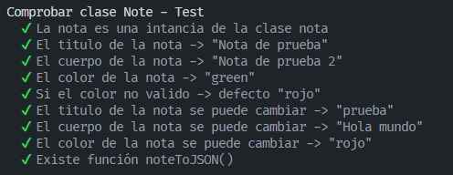
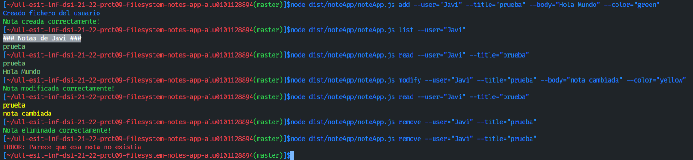
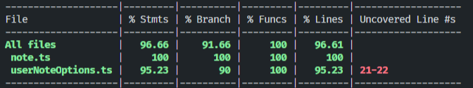

# Práctica 9 - Aplicación de procesamiento de notas de texto

## Índice
- [1. Introduccion](#introduccion)
- [2. Pasos](#pasos)
- [3. Desarrollo de los ejercicios](#desarrollo)
- [4. Cubrimiento del código](#cubrimiento)
- [5. Workflow con Github Actions e integración continua](#workflow)
- [6. Dificultades y conclusion](#conclusion)
- [7. Referencias](#referencias)

## 1. Introducción <a name="introduccion"></a>
Esta novena práctica usaremos un tipo de práctica relacionado con una aplicación del díal. En este caso vamos a aprender cómo usar la API síncrona de `Node.js` así como otras herramientas como `yargs` para interactuar con argumentos de la linea de comandos y `chalk`, que nos permite añadir un color al output de la terminal.

Además de esto, también se trabajará con **Github Actions** y la integración continua. También tenemos una configuracioń del flujo de trabajo para trabajar con **Coveralls y SonarCloud**.

## 2. Pasos <a name="pasos"></a>
Para poder aprovechar la **api síncrona de Node.JS para trabajar con ficheros** se instala este paquete:
```bash
npm install --save-dev @types/node
```
Para instalar el paquete **chalk**:
```bash
npm install chalk@4.1.2
```
Finalmente necesitamos instalar el paquete **yargs**. Para ello debemos instalar tanto el propio yargs como el paquete **@types/yargs**. 
```bash
npm install yargs
npm install --save-dev yargs @types/yargs
```
## 3. Desarrollo de los ejercicios <a name="desarrollo"></a>

[Acceso al código Typescript.](https://github.com/ULL-ESIT-INF-DSI-2122/ull-esit-inf-dsi-21-22-prct09-filesystem-notes-app-alu0101128894/tree/master/src/noteApp)

[Acceso a las Pruebas.](https://github.com/ULL-ESIT-INF-DSI-2122/ull-esit-inf-dsi-21-22-prct09-filesystem-notes-app-alu0101128894/tree/master/tests/noteApp_Test)

[Acceso al TypeDoc](https://github.com/ULL-ESIT-INF-DSI-2122/ull-esit-inf-dsi-21-22-prct09-filesystem-notes-app-alu0101128894/tree/master/typedoc)

Para llevar a cabo esta práctica he creado diversas clases:

### Clase Note

- [Acceso al código (Typescript).](https://github.com/ULL-ESIT-INF-DSI-2122/ull-esit-inf-dsi-21-22-prct09-filesystem-notes-app-alu0101128894/blob/master/src/noteApp/note.ts)

- [Acceso a las pruebas.](https://github.com/ULL-ESIT-INF-DSI-2122/ull-esit-inf-dsi-21-22-prct09-filesystem-notes-app-alu0101128894/blob/master/tests/noteApp_Test/note.spec.ts)

Esta clase es la clase más importante puesto que representa la nota.

```ts
export class Note {
  private color: string;
  private coloresPosibles: string[] = ['red', 'yellow', 'blue', 'green'];
  constructor(private title: string, private body: string, color_: string) {
    try {
      if (!this.coloresPosibles.includes(color_)) {
        this.color = 'red';
        throw new Error('El color no valido, se pondrá el rojo por defecto');
      } else {
        this.color = color_;
      }
    } catch (err) {
      console.log(chalk.default.red(err.message));
    }
  }
  setTitle(title: string): void {
    this.title = title;
  }
  setBody(body: string): void {
    this.body = body;
  }
  setColor(color: colores): void {
    this.color = color;
  }
  getTitle(): string {
    return this.title;
  }
  getBody(): string {
    return this.body;
  }
  getColor(): string {
    return this.color;
  }
  noteToJSON(): string {
    return '{\n\"title\": \"' + this.title + '\",\n\"body\": \"'+ this.body + '\",\n\"color\": \"' + this.color + '\"\n}';
  }
}

```
### EXPLICACIÓN note

La nota está compuesto por un **título**, un **cuerpo**, es decir, un mensaje y por un **color**. En la que cada una tenemos un Getters y Setters. Y por último tenemos la función noteToJSON() para poder transformar la nota en formato JSON y así poder modificarlo.

### TESTS REALIZADOS

```ts
import 'mocha';
import {expect} from 'chai';
import {Note} from '../../src/noteApp/note';

describe('Comprobar clase Note - Test', () => {
  let nota1 = new Note('Nota de prueba', 'Nota de prueba 2', 'green');
  let notafail = new Note('Nota de prueba fail', 'Nota de prueba 2', 'white');
  it('La nota es una intancia de la clase nota', () => {
    expect(nota1).to.be.instanceOf(Note);
  });
  it('El titulo de la nota -> "Nota de prueba"', () => {
    expect(nota1.getTitle()).to.be.eql('Nota de prueba');
  });
  it('El cuerpo de la nota -> "Nota de prueba 2"', () => {
    expect(nota1.getBody()).to.be.eql('Nota de prueba 2');
  });
  it('El color de la nota -> "green"', () => {
    expect(nota1.getColor()).to.be.eql('green');
  });
  it('Si el color no valido -> defecto "rojo"', () => {
    expect(notafail.getColor()).to.be.eql('red');
  });
  it('El titulo de la nota se puede cambiar -> "prueba"', () => {
    nota1.setTitle('prueba');
    expect(nota1.getTitle()).to.be.eql('prueba');
  });
  it('El cuerpo de la nota se puede cambiar -> "Hola mundo"', () => {
    nota1.setBody('Hola mundo');
    expect(nota1.getBody()).to.be.eql('Hola mundo');
  });
  it('El color de la nota se puede cambiar -> "rojo"', () => {
    nota1.setColor('red');
    expect(nota1.getColor()).to.be.eql('red');
  });
  it('Existe función noteToJSON()', () => {
    expect(nota1.noteToJSON()).to.not.be.null;
  });
});
```
### SALIDA CORRECTAMENTE



### Clase userNoteOptions

[Acceso al código (Typescript).](https://github.com/ULL-ESIT-INF-DSI-2122/ull-esit-inf-dsi-21-22-prct09-filesystem-notes-app-alu0101128894/blob/master/src/noteApp/userNoteOptions.ts)

[Acceso a las pruebas.](https://github.com/ULL-ESIT-INF-DSI-2122/ull-esit-inf-dsi-21-22-prct09-filesystem-notes-app-alu0101128894/blob/master/tests/noteApp_Test/userNoteOptions.spec.ts)

Esta clase es para que el usuario pueda añadir notas, eliminarlas, modificarlas, leerlas y listarlas.

```ts
import * as fs from 'fs';
import * as chalk from 'chalk';
import {colores, Note} from './note';

export class UserNoteOptions {
  constructor() {}
  addNote(usuario: string, titulo: string, cuerpo: string, color: string): void {
    try {
      if (fs.existsSync(`db/${usuario}`) == false) { // Si el directorio del usuario no existe se crea
        console.log('Creado fichero del usuario');
        fs.mkdirSync(`db/${usuario}`, {recursive: true});
      }
      const nota = new Note(titulo, cuerpo, color as colores);
      if (fs.existsSync(`db/${usuario}/${titulo}.json`) == false) {
        fs.writeFileSync(`db/${usuario}/${titulo}.json`, nota.noteToJSON());
        console.log(chalk.default.green('Nota creada correctamente!'));
      } else {
        throw new Error('ERROR: Parece que ya existe una nota con el mismo titulo');
      }
    } catch (err) {
      console.log(chalk.default.red(err.message));
    }
  }
  removeNote(usuario: string, titulo: string): void {
    try {
      if (fs.existsSync(`db/${usuario}/${titulo}.json`) == true) {
        fs.rmSync(`db/${usuario}/${titulo}.json`);
        console.log(chalk.default.green('Nota eliminada correctamente!'));
      } else {
        throw new Error('ERROR: Parece que esa nota no existia');
      }
    } catch (err) {
      console.log(chalk.default.red(err.message));
    }
  }
  modifyNote(usuario: string, titulo: string, cuerpo: string, color: string): void {
    try {
      if (fs.existsSync(`db/${usuario}/${titulo}.json`) == true) {
        const nota = new Note(titulo, cuerpo, color as colores);
        fs.writeFileSync(`db/${usuario}/${titulo}.json`, nota.noteToJSON());
        console.log(chalk.default.green('Nota modificada correctamente!'));
      } else {
        throw new Error('ERROR: Parece que esa nota no existe');
      }
    } catch (err) {
      console.log(chalk.default.red(err.message));
    }
  }
  listNotes(usuario: string): Note[] {
    let listNotes: Note[] = [];
    fs.readdirSync(`db/${usuario}`).forEach((notes) => {
      const info = fs.readFileSync(`db/${usuario}/${notes}`);
      const notaJson = JSON.parse(info.toString());
      const nota = new Note(notaJson.title, notaJson.body, notaJson.color);
      listNotes.push(nota);
    });
    return listNotes;
  }
  readNote(usuario: string, titulo: string): Note|void {
    try {
      if (fs.existsSync(`db/${usuario}/${titulo}.json`) == true) {
        const info = fs.readFileSync(`db/${usuario}/${titulo}.json`);
        const notaJson = JSON.parse(info.toString());
        const nota = new Note(notaJson.title, notaJson.body, notaJson.color);
        return nota;
      } else {
        throw new Error('ERROR: Parece que esa nota no existe');
      }
    } catch (err) {
      console.log(chalk.default.red(err.message));
    }
  }
}
```
### EXPLICACIÓN userNoteOptions

En primer lugar, se debe tener instalado los dos paquetes `chalk` y el paquete `fs` para la gestión de fichero así como la clase **Note**.

- **`addNote(usuario: string, titulo: string, cuerpo: string, color: string)`**:

**→** En la que primero analizamos si existe el directorio, si no, se crea el directorio correspondiente. Después analiza si existe el fichero .json con el mismo nombre que tenía antes, si existe, entonces mostramos por consola un mensaje de error. En otro caso, se crea el correspondiente directorio, se creará el directorio con la función `writeFileSync`.

- **`removeNote(usuario: string, titulo: string)`**:

**→** Se comprueba si la nota que se quiere eliminar existe, si es así con el `rmSync`, podemos eliminar el fichero correspondiente. En caso contrario, monstramos un mensaje de error.

- **`modifyNote(usuario: string, titulo: string, cuerpo: string, color: string)`**:

**→** La principal función es parecida al **add**, en la que sobreescribimos la nota con los nuevos datos. En la que si la nota ya existe, se modificaría, en caso contrario, se enviaría un mensaje de error.

- **`listNotes(usuario: string): Note[]`**:

**→** Se recorre el directorio del usuario correspondiente, se abriría cada uno de los ficheros de las notas y se obtiene la información, conviertiendolo de formato JSON a String y se almacenará en un array de Note.

- **`readNote(usuario: string, titulo: string)`**:

**→** Se comprueba que la nota existe. Si existe, accede al fichero JSON y se obtienen los datos. Se transformaría en string y una vez creado los datos con esa nota, se muestra por consola. En caso de que no exista, un mensaje de error.

### Clase noteApp

[Acceso al código (Typescript).](https://github.com/ULL-ESIT-INF-DSI-2122/ull-esit-inf-dsi-21-22-prct09-filesystem-notes-app-alu0101128894/blob/master/src/noteApp/noteApp.ts)

Esta clase es la interacción con la línea de comandos y sus argumentos.

```ts
import * as chalk from 'chalk';
import * as yargs from 'yargs';

import {Note} from './note';
import {UserNoteOptions} from './userNoteOptions';

const noteOptions = new UserNoteOptions();

yargs.command({
  command: 'add',
  describe: 'Add a new note',
  builder: {
    user: {
      describe: 'User name',
      demandOption: true,
      type: 'string',
    },
    title: {
      describe: 'Note title',
      demandOption: true,
      type: 'string',
    },
    body: {
      describe: 'Note body',
      demandOption: true,
      type: 'string',
    },
    color: {
      describe: 'Note color',
      demandOption: true,
      type: 'string',
    },
  },
  handler(argv) {
    if (typeof argv.user === 'string' && typeof argv.title === 'string' && typeof argv.body === 'string' && typeof argv.color === 'string') {
      noteOptions.addNote(argv.user, argv.title, argv.body, argv.color);
    } else {
      console.log(chalk.default.red('ERROR: Argumentos no validos'));
    }
  },
});

yargs.command({
  command: 'remove',
  describe: 'Remove a note',
  builder: {
    user: {
      describe: 'User name',
      demandOption: true,
      type: 'string',
    },
    title: {
      describe: 'Note title',
      demandOption: true,
      type: 'string',
    },
  },
  handler(argv) {
    if (typeof argv.user === 'string' && typeof argv.title === 'string') {
      noteOptions.removeNote(argv.user, argv.title);
    } else {
      console.log(chalk.default.red('ERROR: Argumentos no validos'));
    }
  },
});

yargs.command({
  command: 'modify',
  describe: 'Modify a note',
  builder: {
    user: {
      describe: 'User name',
      demandOption: true,
      type: 'string',
    },
    title: {
      describe: 'Note title',
      demandOption: true,
      type: 'string',
    },
    body: {
      describe: 'Note body',
      demandOption: true,
      type: 'string',
    },
    color: {
      describe: 'Note color',
      demandOption: true,
      type: 'string',
    },
  },
  handler(argv) {
    if (typeof argv.user === 'string' && typeof argv.title === 'string' && typeof argv.body === 'string' && typeof argv.color === 'string') {
      noteOptions.modifyNote(argv.user, argv.title, argv.body, argv.color);
    } else {
      console.log(chalk.default.red('ERROR: Argumentos no validos'));
    }
  },
});

yargs.command({
  command: 'read',
  describe: 'Read a note',
  builder: {
    user: {
      describe: 'User name',
      demandOption: true,
      type: 'string',
    },
    title: {
      describe: 'Note title',
      demandOption: true,
      type: 'string',
    },
  },
  handler(argv) {
    if (typeof argv.user === 'string' && typeof argv.title === 'string') {
      let nota = noteOptions.readNote(argv.user, argv.title);

      if (nota instanceof Note) {
        console.log(chalk.default.keyword(nota.getColor())(nota.getTitle()));
        console.log(chalk.default.keyword(nota.getColor())(nota.getBody()));
      }
    } else {
      console.log(chalk.default.red('ERROR: Argumentos no validos'));
    }
  },
});

yargs.command({
  command: 'list',
  describe: 'List all note',
  builder: {
    user: {
      describe: 'User name',
      demandOption: true,
      type: 'string',
    },
  },
  handler(argv) {
    if (typeof argv.user === 'string') {
      const notas: Note[] = noteOptions.listNotes(argv.user);
      console.log(chalk.default.bgGray.white('### Notas de ' + argv.user + ' ###'));
      notas.forEach((nota) => {
        console.log(chalk.default.keyword(nota.getColor())(nota.getTitle()));
      });
    } else {
      console.log(chalk.default.red('ERROR: Argumentos no validos'));
    }
  },
});

yargs.parse();
```

### EXPLICACIÓN noteApp

Las primeras líneas corresponde a las dependencias **chalks** y **yargs**.

La estructura principal con un comando de ejemplo por el módulo yargs será esto:

```ts
yargs.command({
  command: 'add',
  describe: 'Add a new note',
  builder: {
    title: {
      describe: 'Note title',
      demandOption: true,
      type: 'string',
    },
  },
  handler(argv) {
    if (typeof argv.title === 'string') {
      // Required logic to add a new note
    }
  },
});
```
En **command** y **describe** se define el nombre y una descripción del comando. En **builder** se define los argumentos y también un atributo **demandOption** indicando si es obligatorio o no.

En caso de que falte algunos de los 4 parámetros: **user, title, body y color**, el paquete yargs implementa una "ayuda" para indicar que opciones hay y ver el motivo de su error.

En caso de que sea por parámetros, pues se comprueba todo tipo de pruebas, y si no es así, se mostraría un error por consola.

### Ejemplo de ejecución



### TESTS REALIZADOS

```ts
import 'mocha';
import * as fs from 'fs';
import {expect} from 'chai';
import {Note} from '../../src/noteApp/note';
import {UserNoteOptions} from '../../src/noteApp/userNoteOptions';

describe('Comprobar clase userNoteOptions - Tests', () => {
  let userOptions = new UserNoteOptions();
  it('Se puede crear una nueva nota ', () => {
    userOptions.addNote('Test', 'Nota_test', 'Nota prueba', 'green');
    expect(fs.existsSync('db/Test/Nota_test.json')).true;
  });
  it('Si la nota existe, da error si vuelves a crearla', () => {
    expect(userOptions.addNote('Test', 'Nota_test', 'Nota prueba', 'green')).to.be.undefined;
  });
  it('Se puede modificar una nota correctamente', () => {
    userOptions.modifyNote('Test', 'Nota_test', 'Nota prueba modificada', 'blue');
    expect(fs.existsSync('db/Test/Nota_test.json')).true;
    let info = fs.readFileSync('db/Test/Nota_test.json');
    expect(info.toString()).to.be.eql('{\n\"title\": \"Nota_test' + '\",\n\"body\": \"Nota prueba modificada'+ '\",\n\"color\": \"blue' + '\"\n}');
  });
  it('Se puede listar las notas de un usuario correctamente', () => {
    userOptions.addNote('Test', 'Nota_test2', 'Nota prueba', 'green');
    let nota1 = new Note('Nota_test', 'Nota prueba modificada', 'blue');
    let nota2 = new Note('Nota_test2', 'Nota prueba', 'green');
    expect(userOptions.listNotes('Test')).to.be.eql([nota1, nota2]);
  });
  it('Se puede leer una nota correctamente', () => {
    let nota1 = new Note('Nota_test', 'Nota prueba modificada', 'blue');
    expect(userOptions.readNote('Test', 'Nota_test')).to.be.eql(nota1);
  });
  it('Se puede eliminar una nota correctamente', () => {
    userOptions.removeNote('Test', 'Nota_test');
    userOptions.removeNote('Test', 'Nota_test2');
    expect(fs.existsSync('db/Test/Nota_test.json')).false;
    expect(fs.existsSync('db/Test/Nota_test2.json')).false;
  });
  it('Si la nota no existe, da error si la modificas', () => {
    expect(userOptions.modifyNote('Test', 'Nota_test', 'Nota prueba modificada', 'blue')).to.be.undefined;
  });
  it('Si la nota no existe, da error si la intentas leer', () => {
    expect(userOptions.readNote('Test', 'Nota_test')).to.be.undefined;
  });
  it('Si la nota no existe, da error si la intentas borrar', () => {
    expect(userOptions.removeNote('Test', 'Nota_test2')).to.be.undefined;
  });
});
```

### SALIDA CORRECTAMENTE


## 4. Cubrimiento del código <a name="cubrimiento"></a>

Aquí se puede observar todo el cubrimiento de todo el código



## 5. Workflow con Github Actions e integración continua <a name="workflow"></a>

Se ha seguido el tutorial propuesto por el profesor.

Este primer paso es para la configuración para ejecutar el códigoy las pruebas en distintas versión de Node.js y comprobar su funcionamiento.

**[Tutorial Typescript ejecutado en Node.js](https://drive.google.com/file/d/1hwtPovQlGvthaE7e7yYshC4v8rOtLSw0/view)**

```
name: Tests

on:
  push:
    branches: [ master ]
  pull_request:
    branches: [ master ]

jobs:
  build:

    runs-on: ubuntu-latest

    strategy:
      matrix:
        node-version: [14.x, 16.x]
        # See supported Node.js release schedule at https://nodejs.org/en/about/releases/

    steps:
    - uses: actions/checkout@v3
    - name: Use Node.js ${{ matrix.node-version }}
      uses: actions/setup-node@v3
      with:
        node-version: ${{ matrix.node-version }}
    - run: npm install
    - run: npm test

```

Aquí se ha eliminado la versión 12.x ya que no funcionan por el paquete  **fs**. Por ejemplo, la función `mkdirSync` no las reconoce.

**[Tutorial Workflow GH Actions Coveralls](https://drive.google.com/file/d/1yOonmpVbOyvzx3ZbXMQTAPxvA3a7AE7w/view)**

Una vez realizado el tutorial, en nuestro directorio `.github/workflows` crearemos el fichero `coveralls.yml`:

```
name: Coveralls 

on:
  push:
    branches: [ master ]
  pull_request:
    branches: [ master ]

jobs:
  coveralls:

    runs-on: ubuntu-latest

    steps:
    - name: Cloning repo
      uses: actions/checkout@v2
    - name: Use Node.js 16.x
      uses: actions/setup-node@v2
      with:
        node-version: 16.x
    - name: Installing dependencies
      run: npm install
    - name: Generating coverage information
      run: npm run coverage
    - name: Coveralls GitHub Action
      uses: coverallsapp/github-action@master
      with:
        github-token: ${{ secrets.GITHUB_TOKEN }}
```

**[Tutorial Workflow GH Actions Sonar-Cloud](https://drive.google.com/file/d/1FLPargdPBX6JaJ_85jNsRzxe34sMi-Z3/view)**

Una vez realizado el tutorial, en nuestro directorio `.github/workflows` crearemos el fichero `sonarcloud.yml`:

```
name: Sonar-Cloud 

on:
  push:
    branches: [ master ]
  pull_request:
    branches: [ master ]

jobs:
  sonarcloud:
    name: SonarCloud
    runs-on: ubuntu-latest
    steps:
      - name: Cloning repo
        uses: actions/checkout@v2
        with:
          fetch-depth: 0  # Shallow clones should be disabled for a better relevancy of analysis
      - name: Use Node.js 16.x
        uses: actions/setup-node@v2
        with:
          node-version: 16.x
      - name: Installing dependencies
        run: npm install
      - name: Generating coverage report
        run: npm run coverage
      - name: SonarCloud Scan
        uses: SonarSource/sonarcloud-github-action@master
        env:
          GITHUB_TOKEN: ${{ secrets.GITHUB_TOKEN }}  # Needed to get PR information, if any
          SONAR_TOKEN: ${{ secrets.SONAR_TOKEN }}
```

Para finalizar, se creará un fichero llamado **sonar-project.propierties**, en la que contiene:

```
sonar.projectKey=ULL-ESIT-INF-DSI-2122_ull-esit-inf-dsi-21-22-prct09-filesystem-notes-app-alu0101128894
sonar.organization=ull-esit-inf-dsi-2122

# This is the name and version displayed in the SonarCloud UI.
sonar.projectName=ull-esit-inf-dsi-21-22-prct09-filesystem-notes-app-alu0101128894
sonar.projectVersion=1.0

# Path is relative to the sonar-project.properties file. Replace "\" by "/" on Windows.
sonar.sources=.

# Encoding of the source code. Default is default system encoding
sonar.sourceEncoding=UTF-8

# Coverage info
sonar.javascript.lcov.reportPaths=coverage/lcov.info

# Exclude test subdirectories from source scope
sonar.exclusions = typedoc/**/*
```

## 6. Dificultades y conclusión <a name="conclusion"></a>

Los principales problemas que he tenido son los ejemplos claros sobre yargs, por ejemplo, a la hora de entender qué hacia cada una de las funciones que estaba poniendo. Unos de los problemas principales fue el "chalk" en la que tuve que poner en cada uno "chalk.default.color" siendo color el correspondiente color.

Otros de las dificultades fue tratar el manejo de errores en la que implementé un try-catch en la funciones para así poder manejar los posibles errores. La práctica en sí no resultó ser tan dificil como pensé en un principio

## 7. Referencias <a name="referencias"></a>

- [Guión práctica 9](https://ull-esit-inf-dsi-2122.github.io/prct09-filesystem-notes-app/)
- [Apuntes sobre Node.js](https://ull-esit-inf-dsi-2122.github.io/nodejs-theory/nodejs-intro.html)
- [Guía para crear un proyecto](https://ull-esit-inf-dsi-2122.github.io/typescript-theory/typescript-project-setup.html)
- [Tutorial de instalación y configuracion Typedoc](https://drive.google.com/file/d/19LLLCuWg7u0TjjKz9q8ZhOXgbrKtPUme/view)
- [Tutorial de instalación y configuración de Mocha y Chai en Typescript](https://drive.google.com/file/d/1-z1oNOZP70WBDyhaaUijjHvFtqd6eAmJ/view)
- [Tutorial de instalación y configuración Workflow GH Actions Sonar-Cloud](https://drive.google.com/file/d/1FLPargdPBX6JaJ_85jNsRzxe34sMi-Z3/view)
- [Tutorial de instalación y configuración Workflow GH Actions Coveralls](https://drive.google.com/file/d/1yOonmpVbOyvzx3ZbXMQTAPxvA3a7AE7w/view)
- [tutorial Typescript ejecutado en Node.js](https://drive.google.com/file/d/1hwtPovQlGvthaE7e7yYshC4v8rOtLSw0/view)
- [Guia de Typedoc](https://typedoc.org/guides/installation/)
- [Yargs. Pagina oficial npm](https://www.npmjs.com/package/yargs)
- [Chalk. Pagina oficial npm](https://www.npmjs.com/package/chalk)
