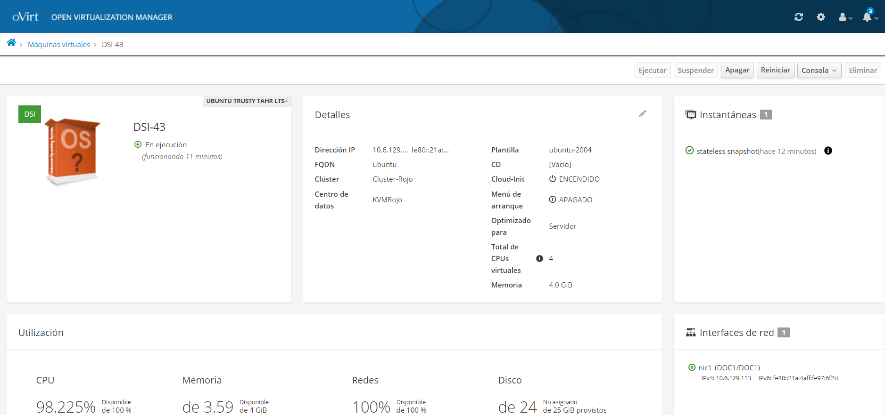
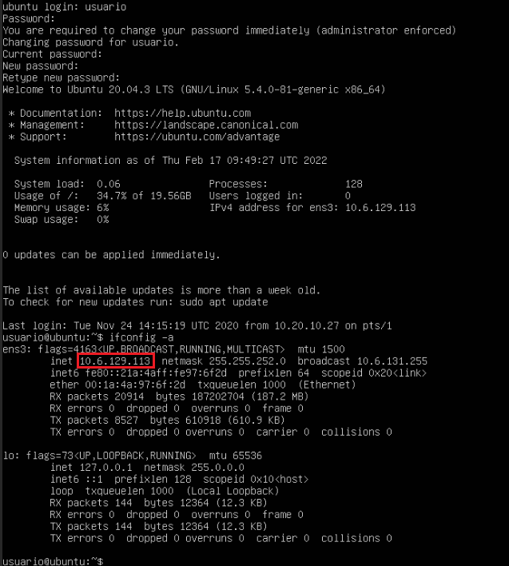
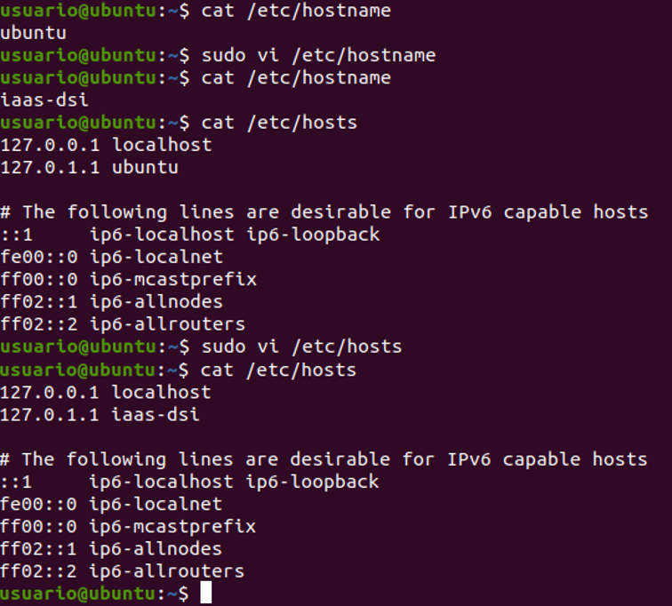
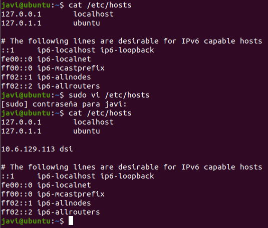
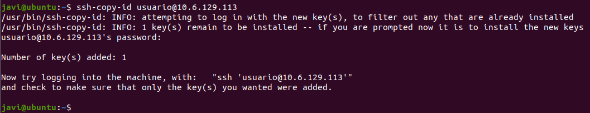
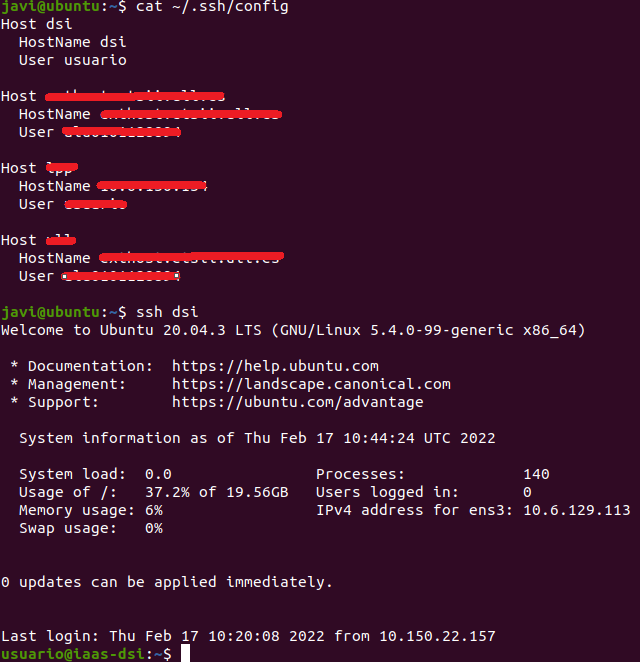
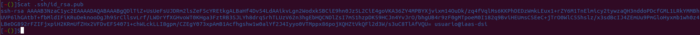
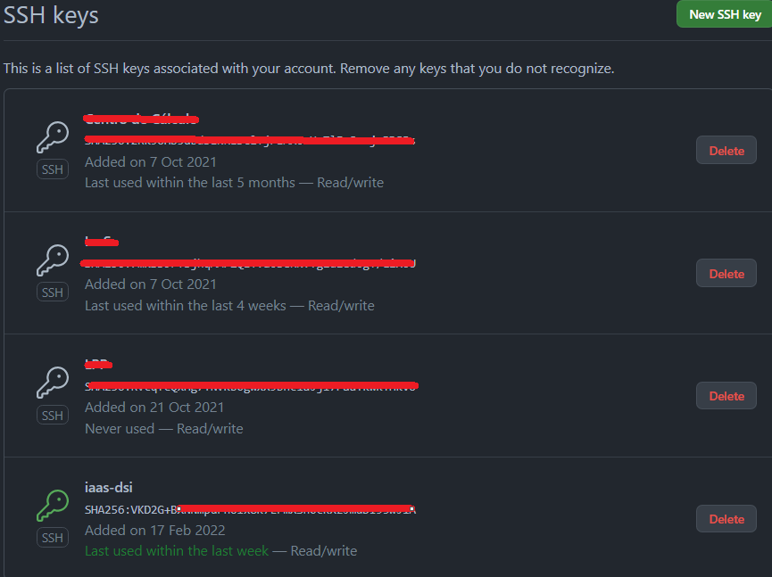
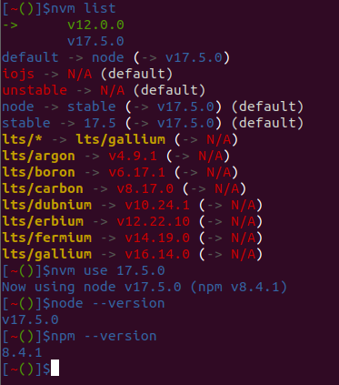

# Práctica 1 - Configuración de máquina virtual en el IaaS

## 1. Introducción
En esta primera práctica de la asignatura de **Desarrollo de Sistemas Informáticos** hay que configurar nuestra máquina virtual en el Iaas con la que haremos todas las prácticas. Se configurará todo los entornos de la máquina, configurando la conexión ssh tanto como remoto como local. A su vez, se configurará el git y el Node.js.
### Objetivos de la práctica 1
1. Configurar la máquina virtual del IaaS
2. Configurar la conexión SSH con la máquina del Iaas
3. Instalar y configurar la conexión con Github Student
4. Instalar nvm (gestor de versiones de Node.js) y Node.js

## 2. Requisitos previos
Para poder realizar las prácticas que vamos a realizar este curso, necesitamos conectarnos a la web del [Iaas](iaas.ull.es). Para ellos, se deberá usar una conexión VPN para poder acceder. Si es el caso de que no podamos acceder, es probable que no estemos conectados a la VPN de la Universidad. Para ello hay una guía explicativa de como se deberá proceder su [instalación y configuración](https://www.ull.es/servicios/stic/2020/12/01/servicio-de-vpn-de-la-ull/). 

## 3. Desarrollo de la práctica

### 3.1 Configuración de la máquina virtual en el IaaS
De lo primero que debemos hacer es conectarnos al [Iaas](iaas.ull.es). Teniendo en cuenta que habría que tener configurada la VPN para establecer conexión con la web como con nuestra máquina. 
Una vez dentro, seleccionamos donde dice **DSI** y le damos en *ejecutar*. Cuando esté listo, se asignará una **IP** (número de sufijo). 


Si seleccionamos en el campo de *detalles*, saldrá nuestra dirección **IP**. Esa es nuestra dirección para conectarnos a nuestra máquina y hacer sus respectivas prácticas.
 

Para su configuración, nos conectaremos en la *Consola VNC (explorador)* y dentro de ella se introduce como usuario y contraseña **usuario y usuario**. A continuación se nos pedirá cambiar la contraseña y la actualizamos. Hacemos un uso del comando `ifconfig -a` para mostrar la interfaz de red de la máquina virtual.
 

Para conectarnos a nuestra máquina escribiremos tal que así:
```bash
...$ ssh usuario@10.6.129.113
```
 
Como es la primera vez que nos vamos a conectarnos se nos aparece un mensaje sobre *fingerprint* (credenciales) y aceptamos todo que sí. Una vez establecido escribimos de nuevo el **usuario** y la contraseña que previamente habíamos cambiado.

A continuación vamos a modificar el nombre de nuestra máquina, es decir, en lugar que salga "Ubuntu" salga por ejemplo "iaas-dsi".
Para ello debemos modificar el fichero _**/etc/hostname**_ y cambiamos el nombre de "Ubuntu" por "iaas-dsi"
```bash
...$ sudo vi /etc/hostname
```
Además de ello, también cambiaremos el nombre del Host de "Ubuntu" por iaas-dsi. Para ello, modificamos el archivo _**/etc/hosts**_ y lo sustituimos.
 

A simple vista no parece que se hayan realizado cambios, para que se establezca los cambios, debemos reiniciar el sistema, pero antes actualizaremos todo el entorno.
```bash
...$ sudo apt update
...$ sudo apt upgrade
```
Y para finalizar, reiniciamos.
```bash
...$ sudo reboot
```
De modo que vamos a salir de nuestra máquina virtual y trajaremos de forma local. Para evitar que no se nos olvide la dirección de nuestra máquina virtual, añadimos al fichero **/etc/hosts**, es decir:
```bash
...$ sudo vi /etc/hosts

//Añado debajo del host local de mi máquina la IP de la máquina virtual.
10.6.129.113   dsi
```
 

Para conectar automáticamente sin necesidad de poner una contraseña cada vez que se nos pida. Primero comprobamos si hemos generado una *clave*.
```bash
...$ cat .ssh/id_rsa.pub 
```
En nuestro caso, ya tenemos la clave generada con anterioridad.
 

Para generar la clave correspondiente, escribiremos:
```bash
...$ ssh-keygen
```
Se seleccionará los parámetros por defecto dando lugar **enter /intro** hasta que termine todo. Para su finalización sólo queda copiar la clave a nuestra máquina del Iaas, es decir:
```bash
...$ ssh-copy-id usuario@10.6.129.113
```
Con ello, ya tenemos nuestro token y podemos iniciar la conexión sin necesidad de poner una contraseña
 

Si por ejemplo, nos gustaría que **no** tengamos que poner el "usuario" al inciar la conexión SSH, entonces editaremos el fichero _**~/.ssh/config**_. Si por un casual, no lo tenemos creado, se deberá crearlo.
```bash
...$ touch ~/.ssh/config  //En caso de que no exista el fichero
...$ vi ~/.ssh/config

//Se añade
Host dsi
  Hostname dsi
  User usuario

...$ cat ~/.ssh/config
//Comprueba que está todo correcto
```
Como se puede comprobar en el campo *Host* ponemos de nombre "dsi". Y en *Hostname* la IP que tenemos asignada anteriormente, en el fichero /etc/hosts/ lo tenemos llamado *dsi*, así que puede ser válido agregar ese nombre.
 

Para realizar esa conexión, se deberá escribir tal que:
```bash
...$ ssh dsi
```

### 3.2 Instalación de git en la máquina virtual del IaaS

Para comenzar a realizar el Git, debemos generar una clave pública-privada en nuestra máquina virtual del Iaas.
Comprobabamos que tenemos el **Git** instalado, aunque no haría falta ya que viene ya instaladas en las máquinas del Iaas.
```bash
...$ sudo apt install git
```
Lo siguiente será configurar el Git con nuestros datos para tener una información mas precisa.
```bash
...$ git config --global user.name "Javier Díaz"
...$ git config --global user.email alu0101128894@ull.edu.es
```
Para verificarlo, escribimos:
```bash
...$ git config --list
```


A continuación se modificará el prompt para que se nos muestre la rama actual del repositorio. Entonces descargamos el script [git-prompt.sh](https://github.com/git/git/blob/master/contrib/completion/git-prompt.sh). y seguimos los pasos:
```bash
...$ mv git-prompt.sh .git-prompt.sh
...$ vi .bashrc
```
Y añadimos al final de la línea del fichero **.bashrc**
```
source ~/.git-prompt.sh
PS1='\[\033]0;\u@\h:\w\007\]\[\033[0;34m\][\[\033[0;31m\]\w\[\033[0;32m\]($(git branch 2>/dev/null | sed -n "s/\* \(.*\)/\1/p"))\[\033[0;34m\]]$'
```
Y comprobamos los cambios añadidos:


Antes de clonar el repositorio, copiamos la clave SSH que hemos generado en la cuenta de Github. 
Es decir, copiar del fichero **id_rsa.pub**.
```bash
...$ cat ~/.ssh/id_rsa.pub
```


Copiamos nuestra clave y accedemos a la cuenta de nuestro Github. Abrimos en **configuración** y en la parte de **SSH and GPG keys**, le damos en **"New SSH key"** y pegamos nuestra clave.


Clonamos nuestro repositorio vacío para comprobar que está todo en orden.
```bash
...$ git clone git@github.com:ULL-ESIT-INF-DSI-2122/ull-esit-inf-dsi-21-22-prct01-iaas-alu0101128894.git
```


Seguidamente en nuestro repositorio, hacemos un cambio de directorio para mostrar como cambia el prompt.


### 3.3 Instalación Node Version Manager (nvm) y Node.js
Instalamos el nvm.
```bash
$wget -qO- https://raw.githubusercontent.com/nvm-sh/nvm/v0.37.2/install.sh | bash
exec bash -l
nvm --version
```
Instalaremos la versión **más reciente** de **Node.js** y comprobamos sus versiones
```bash
...$ nvm install node

...$ node --version
...$ npm --version
```


Si por un casual, queremos cambiar de versión, instalaremos la versión 12.0.0 o otra versión apta. 


Con el fin de cambiar una versión del nvm, debemos realizar una serie de comandos:
1. Listar las versiones que tenemos instaldas
```bash
nvm list
```
2. Seleccionar cual queremos usar actualmente. En nuestro caso pondremos la v17.5.0  
```bash
nvm use v17.5.0 
```
3. Comprobamos que se ha seleccionado correctamente
```bash
...$ nvm use v17.5.0 
...$ node --version
...$ npm --version
```


## 4. Conclusión de la práctica
Teniendo en cuenta que estamos en la práctica 1, y que estamos realizando configuraciones sobre Iaas, git, y node.js, la realización me ha parecido sencilla pero un tanto capciosa. No he visto una gran complejidad en cuanto a comandos se refiere.

Así como conclusión, este tipo de prácticas como "introduccción" está súper bien porque nos permite trabajar en igualdad de condiciones y así saber las partes fundamentales de esta asignatura, como por ejemplo, el git, las conexiones remotas, el Iaas, etc.

## 5. Recursos y Webgrafía
- #### [Guión Práctica 1 DSI](https://ull-esit-inf-dsi-2122.github.io/prct01-iaas/). Guión de la asignatura donde detalla el desarrollo de la práctica 1.
- #### [Markdown](https://guides.github.com/features/mastering-markdown/). Guía de Github sobre Markdown.
- #### [Servicio VPN ULL](https://www.ull.es/servicios/stic/2020/12/01/servicio-de-vpn-de-la-ull/). Como acceder a la VPN de la Universidad de La Laguna.
- #### [VincentTam _config.yml on Github](https://github.com/daattali/beautiful-jekyll/blob/master/_config.yml). Archivo _config.yml con explicaciones.