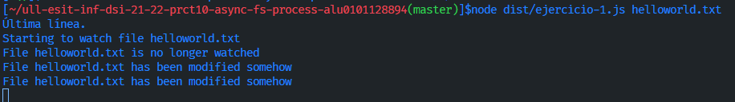
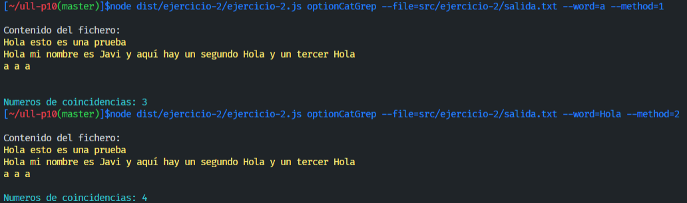
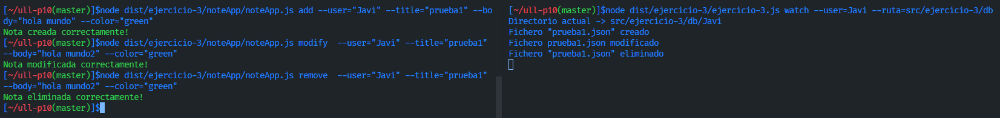
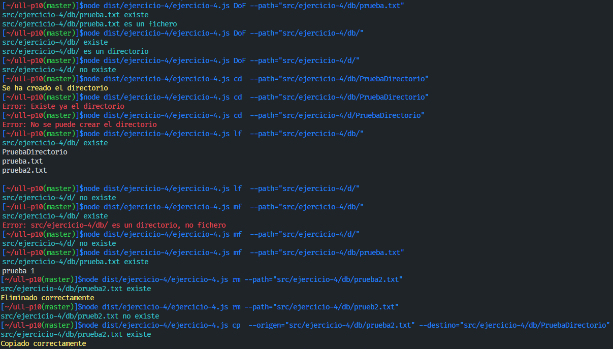

# Práctica 10 - Sistema de ficheros y creación de procesos en Node.js

## Índice
- [1. Introducción.](#introduccion)
- [2. Pasos.](#pasos)
- [3. Desarrollo de los ejercicios.](#desarrollo)
- [4. Ejercicio 1.](#ejercicio1)
- [5. Ejercicio 2.](#ejercicio2)
- [6. Ejercicio 3.](#ejercicio3)
- [7. Ejercicio 4.](#ejercicio4)
- [8. Workflow con Github Actions e integración continua.](#workflow)
- [9. Dificultades y conclusión.](#conclusion)
- [10. Referencias.](#referencias)

## 1. Introducción. <a name="introduccion"></a>
Esta décima práctica nos pide realizar una serie de ejercicios relacionado con el uso de las APIs que nos da el Node.js para su interacción con el sistema de ficheros, como también para crear procesos. Esta práctica se desarrollará un directorio para cada archivo de código fuente. 

Además de esto, también se trabajará con **Github Actions** y la integración continua. También tenemos una configuracioń del flujo de trabajo para trabajar con **Coveralls y SonarCloud**.

## 2. Pasos. <a name="pasos"></a>
Para poder aprovechar la **api síncrona de Node.JS para trabajar con ficheros** se instala este paquete:
```bash
npm install --save-dev @types/node
```
Para instalar el paquete **chalk**:
```bash
npm install chalk@4.1.2
```
Finalmente necesitamos instalar el paquete **yargs**. Para ello debemos instalar tanto el propio yargs como el paquete **@types/yargs**. 
```bash
npm install yargs
npm install --save-dev yargs @types/yargs
```
## 3. Desarrollo de los ejercicios. <a name="desarrollo"></a>
[Guión de la práctica 10.](https://ull-esit-inf-dsi-2122.github.io/prct10-async-fs-process/)

[Acceso al código fuente (src).](https://github.com/ULL-ESIT-INF-DSI-2122/ull-esit-inf-dsi-21-22-prct10-async-fs-process-alu0101128894/tree/master/src)

[Acceso a las Pruebas Unitarias (Tests).](https://github.com/ULL-ESIT-INF-DSI-2122/ull-esit-inf-dsi-21-22-prct10-async-fs-process-alu0101128894/tree/master/tests)

[Acceso al TypeDoc.](https://github.com/ULL-ESIT-INF-DSI-2122/ull-esit-inf-dsi-21-22-prct10-async-fs-process-alu0101128894/tree/master/typedoc)

## 4. Ejercicio 1.<a name="ejercicio1"></a>

[Acceso al código del ejercicio 1.](https://github.com/ULL-ESIT-INF-DSI-2122/ull-esit-inf-dsi-21-22-prct10-async-fs-process-alu0101128894/blob/master/src/ejercicio-1/ejercicio-1.ts)

### Código Ejercicio 1.

```ts
import {access, constants, watch} from 'fs';

if (process.argv.length !== 3) {
  console.log('Please, specify a file');
} else {
  const filename = process.argv[2];

  access(filename, constants.F_OK, (err) => {
    if (err) {
      console.log(`File ${filename} does not exist`);
    } else {
      console.log(`Starting to watch file ${filename}`);

      const watcher = watch(process.argv[2]);

      watcher.on('change', () => {
        console.log(`File ${filename} has been modified somehow`);
      });

      console.log(`File ${filename} is no longer watched`);
    }
  });
  console.log('Última línea.');
}
```
### Preguntas Ejercicio 1.

- `¿Qué hace la función access?` La función access comprueba los permisos de accesos que tienen un usuario para acceder a una ruta que se le especifica como argumento. Por defecto este objeto se define como **fs.constants.F_OK**.

- `¿Para qué sirve el objeto constants?` El objeto constants es un argumento opcional de la función access. Una manera de interactuar con un directorio o fichero.

Hay 4 tipos:
- **F_OK**: Comprueba si el fichero/directorio existe
- **R_OK**: Comprueba si tenemos permisos de lectura en el fichero/directorio
- **W_OK**: Comprueba si tenemos permisos de escritura en el fichero/directorio
- **X_OK**: Comprueba si tenemos permisos de ejecución en el fichero/directorio

### Ejecución Ejercicio 1.

Para poder ejecutar el programa escribimos: `node ./dist/ejercicio-1.js helloworld.txt`. Pasando como argumento el *filename* del fichero a vigilar.

Si ejecutamos correctamente, nos mostrará lo siguiente por terminal: 

```bash
Starting to watch file helloworld.txt
File helloworld.txt is no longer watched.
```

Si realizamos algún cambio sobre el fichero **helloworld.txt**, entonces nos muestra el siguiente mensaje: `File helloworld.txt has been modified somehow`. El objeto *watcher* está recibiendo de la función **watch()** un argumento de tipo **change**.

Un ejemplo práctico, es añadir en la última línea un console.log, y como se puede observar se imprime antes puesto que los mensaje del **access** están declarado después.



## 5. Ejercicio 2.<a name="ejercicio2"></a>

Este segundo ejercicio nos pide que devuelva el número de ocurrencias de una palabra en un fichero de texto. Esta información la debemos obtener de dos maneras: usando `pipe` y `sin usar pipe`.

[Acceso al código del ejercicio 2.](https://github.com/ULL-ESIT-INF-DSI-2122/ull-esit-inf-dsi-21-22-prct10-async-fs-process-alu0101128894/blob/master/src/ejercicio-2/ejercicio-2.ts)

### Código Ejercicio 2.

```ts
import {spawn} from 'child_process';
import yargs from 'yargs';
import chalk from 'chalk';
import * as fs from 'fs';

class classCatGrep {
  constructor(private ruta: string, private palabra: string, private metodo: number) {
    if (this.metodo === 1) {
      this.metodoPipe();
    } else if (this.metodo === 2) {
      this.metodoSinPipe();
    } else {
      console.log(chalk.red('Error: El método no existe'));
    }
  }
  private metodoPipe() { // Método con pipe
    const cat = spawn('cat', [this.ruta]);
    const grep = spawn('grep', [this.palabra]);
    cat.stdout.pipe(grep.stdin);
    let auxGrep = '';
    let contador: number = 0;
    grep.stdout.on('data', (piece) => {
      auxGrep = piece.toString();
    });
    grep.on('close', () => {
      console.log();
      console.log(chalk.white('Contenido del fichero:'));
      console.log(chalk.yellow(auxGrep));
      const result = auxGrep.split(/\s+/);
      result.forEach((item) => {
        if (item === this.palabra) {
          contador++;
        }
      });
      if (contador === 0) {
        console.log();
        console.log(chalk.red(`No hay coincidencias con: ${this.palabra}`));
      } else {
        console.log();
        console.log(chalk.cyan(`Numeros de coincidencias: ${contador}`));
      }
    });
  }
  private metodoSinPipe() { // Método sin pipe
    const catGrep = spawn('cat', [this.ruta, 'grep', this.palabra]);
    let contador: number = 0;
    let auxCatGrep = '';
    catGrep.stdout.on('data', (n) => {
      auxCatGrep = n.toString();
    });
    catGrep.on('close', () => {
      console.log();
      console.log(chalk.white('Contenido del fichero:'));
      console.log(chalk.yellow(auxCatGrep));
      const result = auxCatGrep.split(/\s+/);
      result.forEach((item) => {
        if (item === this.palabra) {
          contador++;
        }
      });
      if (contador === 0) {
        console.log();
        console.log(chalk.red(`No hay coincidencias con: ${this.palabra}`));
      } else {
        console.log();
        console.log(chalk.cyan(`Numeros de coincidencias: ${contador}`));
      }
    });
  }
}
yargs.command({
  command: 'optionCatGrep',
  describe: 'Comando para contar el numero de coincidencias en el fichero',
  builder: {
    file: {
      describe: 'nombre del fichero',
      demandOption: true,
      type: 'string',
    },
    word: {
      describe: 'Comprobar coincidencias',
      demandOption: true,
      type: 'string',
    },
    method: {
      describe: 'Meotodo para seleccionar',
      demandOption: true,
      type: 'number',
    },
  },
  handler(argv) {
    if ((typeof argv.file === 'string') && (typeof argv.word === 'string') && (typeof argv.method === 'number')) {
      if (fs.existsSync(argv.file) === true) {
        const catGrep = new classCatGrep(argv.file, argv.word, argv.method);
      } else {
        console.log(chalk.red('Error: El fichero no existe'));
      }
    }
  },
});

yargs.parse();

```
### Explicación Ejercicio 2.

#### Explicación "metodoPipe".

Tenemos una clase classCatGrep con un método privado `metodoPipe()` en la que guardamos dos valores **cat** y **grep** en la que hacemos un uso del spawn. El spawn nos permite crear procesos hijos, entonces, se puede pasar parámetros y así obtener la información que queremos, y luego redirigiendo la información con `pipe`.

#### Explicación "metodoSinPipe".

En este caso, la diferencia principal es que no se usa el pipe. Entonces se invoca el subproceso **stdout.on**. En la que con el método **on** se le indica el "evento" *close*. Las funciones principales no cambian respecto a la funcion con pipe.

Para poder utilizar estas funciones, se hace el uso de yargs, en la que invocamos la ruta, la palabra y el método a usar:

```bash
node dist/ejercicio-2/ejercicio-2.js catGrepOption --file=src/ejercicio-2/salida.txt --word=a --method=1
node dist/ejercicio-2/ejercicio-2.js catGrepOption --file=src/ejercicio-2/salida.txt --word=Hola --method=2
```

### Ejecución Ejercicio 2.

Todos los comandos empleados:

```r
node dist/ejercicio-2/ejercicio-2.js optionCatGrep --file=src/ejercicio-2/salida.txt --word=a --method=1

node dist/ejercicio-2/ejercicio-2.js optionCatGrep --file=src/ejercicio-2/salida.txt --word=Hola --method=2
```



## 6. Ejercicio 3.<a name="ejercicio3"></a>

En este tercer ejercicio nos pide reutilizar la **Práctica 9** en la que nos permitía crear, modificar y eliminar notas dentro de ficheros de distintos usuarios. Ahora nos pide utilizar una función watch con la función `fs.watch()`, como por ejemplo, si la carpeta seleccionada recibe algún cambio en los ficheros que contiene.

En la función `watch` tiene unos tipos de eventos como:
 - Crear ficheros: change y rename
 - Modificar ficheros: change y change
 - Eliminar ficheros: rename

También se ha utilizado una variable boleana **watch** a true, lo utilizamos con `setTimeout()` para así poder evitar duplicidades en los mensajes, ya que nos saldría dos mensajes. Además de ello se puede observar que el **change** ha modificado el fichero.

En el caso de salga un evento de tipo **rename** indica si se ha creado o eliminado el fichero, entonces para poder distingir cada una de las dos, se utiliza el `access`, en la que comprobamos su existencia si está "manipulado" y nos da un error, es decir, que ha sido eliminado. En caso contrario, quiere decir que el fichero ha sido creado.

### Código Ejercicio 3.

[Acceso al código del ejercicio 3. (NoteApp)](https://github.com/ULL-ESIT-INF-DSI-2122/ull-esit-inf-dsi-21-22-prct10-async-fs-process-alu0101128894/tree/master/src/ejercicio-3/noteApp)

[Acceso al código del ejercicio 3.](https://github.com/ULL-ESIT-INF-DSI-2122/ull-esit-inf-dsi-21-22-prct10-async-fs-process-alu0101128894/blob/master/src/ejercicio-3/ejercicio-3.ts)


```ts
import * as fs from 'fs';
import * as chalk from 'chalk';
import * as yargs from 'yargs';

function userWatch(usuario: string, ruta: string) {
  let rutaUsuario: string = ruta;

  rutaUsuario += '/' + usuario;

  console.log('Directorio actual -> ' + rutaUsuario);

  let watch: boolean = false;
  fs.watch(rutaUsuario, (type, filename) => {
    if (watch) return;
      watch = true;
    if (type == 'rename') { // creado o eliminado fichero
      fs.access(rutaUsuario + '/' + filename, (err) => { // existencia fichero
        if (err) {
          console.log('Fichero "' + filename + '" eliminado');
        } else {
          console.log('Fichero "' + filename + '" creado');
        }
      });
    } else {
      fs.access(rutaUsuario + '/' + filename, (err) => {
        if (err) {
          console.log('ERROR: Problema con el fichero ' + filename);
        } else {
          console.log('Fichero ' + filename + ' modificado');
        }
      });
    }
    setTimeout(() => {watch = false;}, 100); // evitar duplicados
  });
}

yargs.command({
  command: 'watch',
  describe: 'new watch',
  builder: {
    user: {
      describe: 'User name',
      demandOption: true,
      type: 'string',
    },
    ruta: {
      describe: 'Ruta',
      demandOption: true,
      type: 'string',
    },
  },
  handler(argv) {
    if (typeof argv.user === 'string' && typeof argv.ruta === 'string') {
      userWatch(argv.user, argv.ruta);
    } else {
      console.log(chalk.default.red('ERROR: Argumentos no validos'));
    }
  },
});

yargs.parse();
```

### Ejecución Ejercicio 3.

Todos los comandos empleados:

```r
node dist/ejercicio-3/noteApp/noteApp.js add --user="Javi" --title="prueba1" --body="hola mundo" --color="green"
node dist/ejercicio-3/noteApp/noteApp.js modify  --user="Javi" --title="prueba1" --body="hola mundo2" --color="green"
node dist/ejercicio-3/noteApp/noteApp.js remove  --user="Javi" --title="prueba1" --body="hola mundo2" --color="green"

node dist/ejercicio-3/ejercicio-3.js watch --user="Javi" --ruta="src/ejercicio-3/db"
```



### Preguntas Ejercicio 3.

- **¿Cómo haría para mostrar, no solo el nombre, sino también el contenido del fichero, en el caso de que haya sido creado o modificado?**

Simplemente utilizando ka función watch directamente lo retorna, como por ejemplo, el nombre del fichero que ha sido modificado. Para saber lo que contiene dentro del fichero, se podría utilizar el spawn para crear un proceso, pasandole como proceso un cat, y de ruta el nombre del fichero y así devolvería el contenido.

- **¿Cómo haría para que no solo se observase el directorio de un único usuario sino todos los directorios correspondientes a los diferentes usuarios de la aplicación de notas?**

En este ejercicio, tengo un directorio **/db** que es un database que contiene los usuarios con sus notas, entonces para ello, se usa la función watch con el path del directorio /db.

### Test Ejercicio 3.

[Acceso a los test del ejercicio 3.](https://github.com/ULL-ESIT-INF-DSI-2122/ull-esit-inf-dsi-21-22-prct10-async-fs-process-alu0101128894/tree/master/tests/ejercicio-3-test)

## 7. Ejercicio 4.<a name="ejercicio4"></a>

En este ejercicio nos pide realizar un **wrapper** de los distintos comandos empleados en Linux para el manejo de ficheros y directorios. En concreto, la aplicación deberá permitir:

1. Dada una ruta concreta, mostrar si es un directorio o un fichero.
2. Crear un nuevo directorio a partir de una nueva ruta que recibe como parámetro.
3. Listar los ficheros dentro de un directorio.
4. Mostrar el contenido de un fichero (similar a ejecutar el comando cat).
5. Borrar ficheros y directorios.
6. Mover y copiar ficheros y/o directorios de una ruta a otra. Para este caso, la aplicación recibirá una ruta origen y una ruta destino.

### Código Ejercicio 4.

[Acceso al código del ejercicio 4.](https://github.com/ULL-ESIT-INF-DSI-2122/ull-esit-inf-dsi-21-22-prct10-async-fs-process-alu0101128894/blob/master/src/ejercicio-4/)

```ts
import {spawn} from 'child_process';
import chalk from 'chalk';
import * as yargs from 'yargs';
import * as fs from 'fs';
import {access, constants} from 'fs';

function ficheroDirectorio(path: string) {
  access(path, constants.F_OK, (err) => {
    console.log(chalk.cyan(`${path} ${err ? 'no existe' : 'existe'}`));
    if (err) {
      process.exit(-1);
    } else {
      fs.open(path, fs.constants.O_DIRECTORY, (err) => {
        if (err) {
          console.log(chalk.cyan(`${path} es un fichero`));
        } else {
          console.log(chalk.cyan(`${path} es un directorio`));
        }
      });
    }
  });
}
function crearDirectorio(path: string) {
  access(path, constants.F_OK, (err) => {
    if (!err) {
      console.log(chalk.red('Error: Existe ya el directorio'));
      process.exit(-1);
    } else {
      fs.mkdir(path, (err) => {
        if (err) {
          console.log(chalk.red('Error: No se puede crear el directorio'));
        } else {
          console.log(chalk.yellow('Se ha creado el directorio'));
        }
      });
    }
  });
}
function listarFicheroDirectorio(path: string) {
  access(path, constants.F_OK, (err) => {
    console.log(chalk.cyan(`${path} ${err ? 'no existe' : 'existe'}`));
    if (err) {
      process.exit(-1);
    } else {
      const lsAux = spawn('ls', [path]);
      let output = '';
      lsAux.stdout.on('data', (chunk) => (output += chunk));
      lsAux.on('close', () => {
        console.log(output);
      });
    }
  });
}
function mostrarFichero(path: string) {
  access(path, constants.F_OK, (err) => {
    console.log(chalk.cyan(`${path} ${err ? 'no existe' : 'existe'}`));
    if (err) {
      process.exit(-1);
    } else {
      fs.open(path, fs.constants.O_DIRECTORY, (err) => {
        if (!err) {
          console.log(chalk.red(`Error: ${path} es un directorio, no fichero`));
          process.exit(-1);
        } else {
          const catAux = spawn('cat', [path]);
          let output = '';
          catAux.stdout.on('data', (chunk) => (output += chunk));
          catAux.on('close', () => {
            console.log(output);
          });
        }
      });
    }
  });
}
function eliminar(path: string) {
  access(path, constants.F_OK, (err) => {
    console.log(chalk.cyan(`${path} ${err ? 'no existe' : 'existe'}`));
    if (err) {
      process.exit(-1);
    } else {
      const rmAux = spawn('rm', ['-r', path]);
      rmAux.on('close', (err) => {
        if (err) {
          console.log(chalk.red('Error: No se ha eliminado el fichero'));
        } else {
          console.log(chalk.yellow('Eliminado correctamente'));
        }
      });
    }
  });
}
function mover(origen: string, destino: string) {
  access(origen, constants.F_OK, (err) => {
    console.log(chalk.cyan(`${origen} ${err ? 'no existe' : 'existe'}`));
    if (err) {
      process.exit(-1);
    } else {
      const cpAux = spawn('cp', ['-r', origen, destino]);
      cpAux.on('close', (err) => {
        if (err) {
          console.log(chalk.red('Error: No se ha movido el directorio'));
        } else {
          console.log(chalk.yellow('Copiado correctamente'));
        }
      });
    }
  });
}
yargs.command( {
  command: 'DoF',
  describe: 'Comprueba si es un un directorio o un fichero',
  builder: {
    path: {
      describe: 'Ruta',
      demandOption: true,
      type: 'string',
    },
  },
  handler(argv) {
    if (typeof argv.path === "string") {
      ficheroDirectorio(argv.path);
    }
  },
});
yargs.command( {
  command: 'cd',
  describe: 'Crear un directorio',
  builder: {
    path: {
      describe: 'Ruta para crear el directorio',
      demandOption: true,
      type: 'string',
    },
  },
  handler(argv) {
    if (typeof argv.path === "string") {
      crearDirectorio(argv.path);
    }
  },
});
yargs.command( {
  command: 'lf',
  describe: 'Listar ficheros de un directorio',
  builder: {
    path: {
      describe: 'Ruta para listar el fichero',
      demandOption: true,
      type: 'string',
    },
  },
  handler(argv) {
    if (typeof argv.path === "string") {
      listarFicheroDirectorio(argv.path);
    }
  },
});
yargs.command( {
  command: 'mf',
  describe: 'Mostrar contenido de un fichero',
  builder: {
    path: {
      describe: 'Fichero que se quiere mostrar',
      demandOption: true,
      type: 'string',
    },
  },
  handler(argv) {
    if (typeof argv.path === "string") {
      mostrarFichero(argv.path);
    }
  },
});
yargs.command( {
  command: 'rm',
  describe: 'Eliminar un fichero o un directorio',
  builder: {
    path: {
      describe: 'Directorio que se quiere eliminar',
      demandOption: true,
      type: 'string',
    },
  },
  handler(argv) {
    if (typeof argv.path === "string") {
      eliminar(argv.path);
    }
  },
});
yargs.command( {
  command: 'cp',
  describe: 'Mover un directorio o fichero de una ruta especificada ',
  builder: {
    origen: {
      describe: 'Directorio origen para eliminar',
      demandOption: true,
      type: 'string',
    },
    destino: {
      describe: 'Directorio destino para eliminar',
      demandOption: true,
      type: 'string',
    },
  },
  handler(argv) {
    if (typeof argv.origen === "string" && typeof argv.destino === "string") {
      mover(argv.origen, argv.destino);
    }
  },
});

yargs.parse();
```

### Explicación Ejercicio 4.

#### Explicación "ficheroDirectorio".

En la primera función de `ficheroDirectorio` comprueba si existe la ruta o no haciendo un uso con la funcion `open` , y le proporcionamos una constante **F_OK** para poder diferenciar si es un directorio o no. Si no es un directorio devuelve un error.

#### Explicación "crearDirectorio".

En la segunda función de `crearDirectorio`, comprobamos si el directorio existe o no, con la función `access`. En caso contrario nos devuelve un error. Comprobado todo esto, se utiliza la función `mkdir` para crear directorios.

#### Explicación "listarFicheroDirectorio".

En la tercer función de `listarFicheroDirectorio`, para poder listar informaciones, utilizaremos la función `spawn` en la que se invoca el proceso **ls** y la redigiremos con un pipe.

#### Explicación "mostrarFichero".

En esta cuarta función de `mostrarFichero` es exactamente lo mismo que la función de *listarFicheroDirectorio* en la que comprobamos anteriormente con la constante **O_DIRECTORY** si es un directorio o no. Y haciendo un uso del `spawn`` en la que se invocará el proceso **cat**.

#### Explicación "eliminar".

En esta quinta función de `eliminar` realizamos un uso de la constante **F_OK** para comprobar si existe o no. Además se utiliza el `spawn` con el proceso **rm**, mismo procedimiento que las demás funciones.

#### Explicación "mover".

En esta última función de `mover` hacemos el mismo procedimiento de la constante **F_OK**. Comprobamos si existe algun tipo de error con la ruta de **origen** y la ruta del **destino**, gracias a la función `spawn` realizamos el proceso **cp**.

### Ejecución Ejercicio 4.

Todos los comandos empleados:

```r
node dist/ejercicio-4/ejercicio-4.js DoF --path="src/ejercicio-4/db/prueba.txt"
node dist/ejercicio-4/ejercicio-4.js DoF --path="src/ejercicio-4/db/"
node dist/ejercicio-4/ejercicio-4.js DoF --path="src/ejercicio-4/d/"
node dist/ejercicio-4/ejercicio-4.js cd  --path="src/ejercicio-4/db/PruebaDirectorio"
node dist/ejercicio-4/ejercicio-4.js cd  --path="src/ejercicio-4/d/PruebaDirectorio"
node dist/ejercicio-4/ejercicio-4.js lf  --path="src/ejercicio-4/db/"
node dist/ejercicio-4/ejercicio-4.js lf  --path="src/ejercicio-4/d/"
node dist/ejercicio-4/ejercicio-4.js mf  --path="src/ejercicio-4/db/"
node dist/ejercicio-4/ejercicio-4.js mf  --path="src/ejercicio-4/d/"
node dist/ejercicio-4/ejercicio-4.js mf  --path="src/ejercicio-4/db/prueba.txt"
node dist/ejercicio-4/ejercicio-4.js rm --path="src/ejercicio-4/db/prueba2.txt"
node dist/ejercicio-4/ejercicio-4.js rm --path="src/ejercicio-4/db/prueb2.txt"
node dist/ejercicio-4/ejercicio-4.js cp  --origen="src/ejercicio-4/db/prueba2.txt" --destino="src/ejercicio-4/db PruebaDirectorio"
```



## 9. Workflow con Github Actions e integración continua. <a name="workflow"></a>

Se ha seguido el tutorial propuesto por el profesor.

- Este primer paso es para la configuración para ejecutar el código y las pruebas en distintas versión de Node.js y comprobar su funcionamiento siguiendo el **[Tutorial Typescript ejecutado en Node.js](https://drive.google.com/file/d/1hwtPovQlGvthaE7e7yYshC4v8rOtLSw0/view)**

[Acceso al tests.js.yml](https://github.com/ULL-ESIT-INF-DSI-2122/ull-esit-inf-dsi-21-22-prct10-async-fs-process-alu0101128894/blob/master/.github/workflows/tests.js.yml)

- Una vez realizado el tutorial, en nuestro directorio `.github/workflows` crearemos el fichero `coveralls.yml` siguiendo el **[Tutorial Workflow GH Actions Coveralls](https://drive.google.com/file/d/1yOonmpVbOyvzx3ZbXMQTAPxvA3a7AE7w/view)**

[Acceso al coveralls.yml](https://github.com/ULL-ESIT-INF-DSI-2122/ull-esit-inf-dsi-21-22-prct10-async-fs-process-alu0101128894/blob/master/.github/workflows/coveralls.yml)

- Una vez realizado el tutorial, en nuestro directorio `.github/workflows` crearemos el fichero `sonarcloud.yml`, para ello seguimos este **[Tutorial Workflow GH Actions Sonar-Cloud](https://drive.google.com/file/d/1FLPargdPBX6JaJ_85jNsRzxe34sMi-Z3/view)**

[Acceso al sonarcloud.yml](https://github.com/ULL-ESIT-INF-DSI-2122/ull-esit-inf-dsi-21-22-prct10-async-fs-process-alu0101128894/blob/master/.github/workflows/sonarcloud.yml)

- Para finalizar, se creará un fichero llamado **sonar-project.propierties**

[Acceso al sonar-project.propierties](https://github.com/ULL-ESIT-INF-DSI-2122/ull-esit-inf-dsi-21-22-prct10-async-fs-process-alu0101128894/blob/master/sonar-project.properties)

## 9. Dificultades y conclusión. <a name="conclusion"></a>

En esta décima práctica se ha seguido utilizando los comandos de **yargs** y además se ha profundizado en los conocimientos sobre el sistema de ficheros y la creación de procesos en Node.js. En cuánto a dificultades solamente he tenido problemas a la hora de realizar las rutas por consola, por falta de interpretación, pero una vez realizado se han comprado correctamente todas sus funcionalidades.

## 10. Referencias. <a name="referencias"></a>

- [Guión práctica 10](https://ull-esit-inf-dsi-2122.github.io/prct10-async-fs-process/)
- [Apuntes sobre Node.js](https://ull-esit-inf-dsi-2122.github.io/nodejs-theory/nodejs-intro.html)
- [Guía para crear un proyecto](https://ull-esit-inf-dsi-2122.github.io/typescript-theory/typescript-project-setup.html)
- [Tutorial de instalación y configuracion Typedoc](https://drive.google.com/file/d/19LLLCuWg7u0TjjKz9q8ZhOXgbrKtPUme/view)
- [Tutorial de instalación y configuración de Mocha y Chai en Typescript](https://drive.google.com/file/d/1-z1oNOZP70WBDyhaaUijjHvFtqd6eAmJ/view)
- [Tutorial de instalación y configuración Workflow GH Actions Sonar-Cloud](https://drive.google.com/file/d/1FLPargdPBX6JaJ_85jNsRzxe34sMi-Z3/view)
- [Tutorial de instalación y configuración Workflow GH Actions Coveralls](https://drive.google.com/file/d/1yOonmpVbOyvzx3ZbXMQTAPxvA3a7AE7w/view)
- [tutorial Typescript ejecutado en Node.js](https://drive.google.com/file/d/1hwtPovQlGvthaE7e7yYshC4v8rOtLSw0/view)
- [Guia de Typedoc](https://typedoc.org/guides/installation/)
- [Yargs. Pagina oficial npm](https://www.npmjs.com/package/yargs)
- [Chalk. Pagina oficial npm](https://www.npmjs.com/package/chalk)
- [NODE.JS sobre file system](https://nodejs.org/api/fs.html)
- [Información NODE.JS sobre child process](https://nodejs.org/api/child_process.html)
