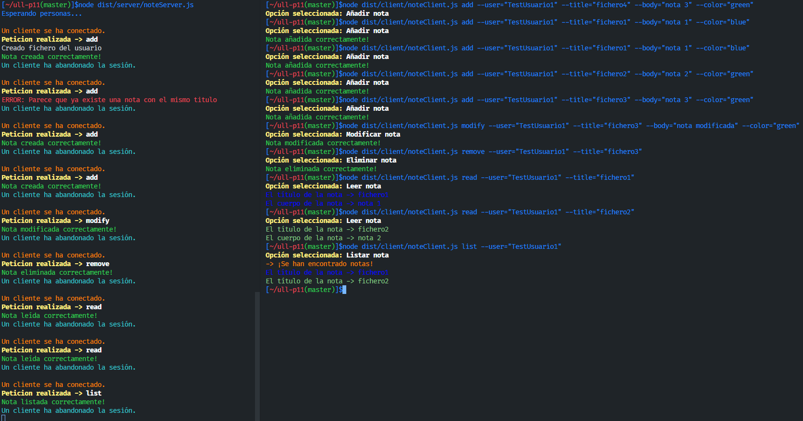
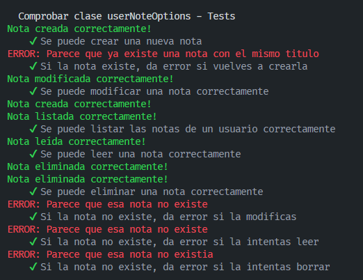
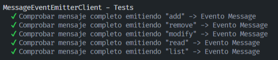
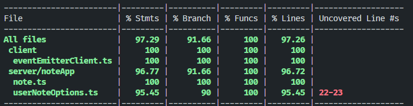

# Práctica 11 - Cliente y servidor para una aplicación de procesamiento de notas de texto

## Índice
- [1. Introducción.](#introduccion)
- [2. Pasos.](#pasos)
- [3. Desarrollo de los ejercicios.](#desarrollo)
- [4. Parte Cliente.](#cliente)
- [5. Parte Servidor.](#servidor)
- [6. Ejecución.](#ejecucion)
- [7. Tests.](#tests)
- [8. Cubrimiento del código.](#cubrimiento)
- [9. Workflow con Github Actions e integración continua.](#workflow)
- [10. Dificultades y conclusión.](#conclusion)
- [11. Referencias.](#referencias)

## 1. Introducción. <a name="introduccion"></a>
Esta undécima práctica es una pequeña evolución de la **práctica 9**, en la que reutilizaremos la aplicación de notas y lo hacemos un uso de **sockets**. En la que nos pide realizar *cliente-servidor*.

En la parte de cliente, se utilizará las peticiones, como por ejemplo, añadir notas, eliminar, modificar, etc... en la que son enviadas por el servidor. Todo esto se conoce como patrón de `petición-respuesta`. 

Además de esto, también se trabajará con **Github Actions** y la integración continua. También tenemos una configuracioń del flujo de trabajo para trabajar con **Coveralls y SonarCloud**.

## 2. Pasos. <a name="pasos"></a>
Para poder aprovechar la **api síncrona de Node.JS para trabajar con ficheros** se instala este paquete:
```r
npm install --save-dev @types/node
```
Para instalar el paquete **chalk**:
```r
npm install chalk@4.1.2
```
Finalmente necesitamos instalar el paquete **yargs**. Para ello debemos instalar tanto el propio yargs como el paquete **@types/yargs**. 
```r
npm install yargs
npm install --save-dev yargs @types/yargs
```
## 3. Desarrollo de los ejercicios. <a name="desarrollo"></a>
[Acceso al guión de la práctica 11.](https://ull-esit-inf-dsi-2122.github.io/prct11-async-sockets/)

[Acceso al fichero código Typescript](https://github.com/ULL-ESIT-INF-DSI-2122/ull-esit-inf-dsi-21-22-prct11-async-sockets-alu0101128894/tree/master/src/Practica)

[Acceso al fichero de pruebas TDD](https://github.com/ULL-ESIT-INF-DSI-2122/ull-esit-inf-dsi-21-22-prct11-async-sockets-alu0101128894/tree/master/tests/Practica_Test)

[Acceso a la documentación generada con Typedoc](https://github.com/ULL-ESIT-INF-DSI-2122/ull-esit-inf-dsi-21-22-prct11-async-sockets-alu0101128894/tree/master/typedoc)

## 4. Parte Cliente.<a name="cliente"></a>

La primera parte fundamental es realizar la conexión del puerto a **60300**. Es decir, guardamos en sockets una constante **client**.

```ts
const client = connect({port: 60300});
```

Ahora establecemos con **yargs** todos los comandos funcionales, esto es una reutilización de la **práctica 9**: 

Ejemplo con yargs con el comando `list`:

```ts
yargs.command({
  command: 'list',
  describe: 'List all note',
  builder: {
    user: {
      describe: 'User name',
      demandOption: true,
      type: 'string',
    },
  },
  handler(argv) {
    if (typeof argv.user === 'string') {
      const data: RequestType = {
        type: 'list',
        user: argv.user,
      };
      console.log(chalk.cyan('-> Opción seleccionada: Listar nota'));
      client.write(`${JSON.stringify(data)}\n`);
    } else {
      console.log(chalk.red('ERROR: Argumentos no válidos'));
    }
  },
});
```

- Como se puede observar tenemos un objeto JSON en **RequestType**** en la que define el `messageType` una estrucuta de datos para que se envíe al servidor. Esto tiene como parámetros el tipo de petición y el usuario conque lo realiza, además también tenemos otros parámetros opcionales.

- Una vez realizado la información correctamente llegado al servidor, se utiliza el comando `write`, en la que se pasa un objeto JSON a una cadena de string, es por ello que se utiliza el *stringify* seguido de un salto de línea **"\n"**, esto quiere decir que el mensaje pasado se ha acabado. Un problema fundamental es no utilizar el **end** porque no se podría mandar una respuesta al cliente en socket, es por ello que se utiliza el **"\n"** y no **end**.

- Cuando se realiza la petición hay que esperar a que el *propio servidor lo procese* y -*devuelva una respuesta* correctamente. 

### Clase EventEmitter

Todas las respuestas obtenidas por el *servidor* es por la clase **MessageEventEmitterClient**. Se obtiene como parámetro la conexión que se ha establecido antes, es decir, recoge todos los "trozos" de mensajes que se envia desde el servidor hasta que se encuentre un **"\n"**, ahí es donde entra el **dataChunk** que se agruparán en **wholeData**. Una vez que se encuentra ese salto de línea, y llega bien el paquete, se emite un evento **MESSAGE**. Todas estas funcionalidades están dentro del fichero `noteClient.ts`

```ts
import {EventEmitter} from 'events';

export class MessageEventEmitterClient extends EventEmitter {
  constructor(connection: EventEmitter) {
    super();

    let wholeData = '';
    connection.on('data', (dataChunk) => {
      wholeData += dataChunk;

      let messageLimit = wholeData.indexOf('\n');
      while (messageLimit !== -1) {
        const message = wholeData.substring(0, messageLimit);
        wholeData = wholeData.substring(messageLimit + 1);
        this.emit('message', JSON.parse(message));
        messageLimit = wholeData.indexOf('\n');
      }
    });
  }
}
```
### Evento Message

Se puede observar que la clase **MessageEventEmitterClient** cuando se emite el evento *message* se emite la información a un formato JSON. Además se hace un uso del switch con case's dependiendo del tipo de respuesta que sea mostrando un correspondiente mensaje.

```ts
clientExecuted.on('message', (message) => {
  switch (message.type) {
    case 'add':
      if (!message.status) {
        console.log(chalk.green('Nota añadida correctamente!'));
      } else {
        console.log(chalk.red('Error: La nota no pudo ser añadida'));
      }
      break;
    case 'remove':
      if (!message.status) {
        console.log(chalk.green('Nota eliminada correctamente!'));
      } else {
        console.log(chalk.red('Error: La nota no pudo ser eliminada'));
      }
      break;
    case 'modify':
      if (!message.status) {
        console.log(chalk.green('Nota modificada correctamente!'));
      } else {
        console.log(chalk.red('Error: La nota no pudo ser modificada'));
      }
      break;
    case 'read':
      if (message.status) {
        let nota = message.notas[0];
        let notaObj = JSON.parse(nota);
        console.log(chalk.keyword(notaObj.color)('El título de la nota -> ' + notaObj.title));
        console.log(chalk.keyword(notaObj.color)('El cuerpo de la nota -> ' + notaObj.body));
      } else {
        console.log(chalk.red('Error: La nota no pudo ser leida'));
      }
      break;
    case 'listar':
      if (message.status) {
        console.log(chalk.hex('#FF8800')('-> ¡Se han encontrado notas!'));
        let aux: string[] = message.notas;
        aux.forEach( (elemento) => {
          let notaObj = JSON.parse(elemento);
          console.log(chalk.keyword(notaObj.color)('El título de la nota -> ' + notaObj.title));
        });
      }
      else {
        console.log(chalk.red('Error: La nota no pudo ser listada'));
      }
      break;
  }
});
```

## 5. Parte Servidor.<a name="servidor"></a>

En la parte del servidor, la idea principal es realizar una conexión para ver si algún cliente se ha conectado con el servidor. Una vez comprobado el paso, con la clase `MessageEventEmitterClient` recoge todos los "trozos" de mensajes que están en **wholeData**, se emite un evento **REQUEST**. Todas estas funcionalidades están dentro del fichero `noteServer.ts`

```ts
  console.log(chalk.hex('#FF8800')('\nUn cliente se ha conectado.'));

  let wholeData = '';
  connection.on('data', (dataChunk) => {
    wholeData += dataChunk;
    let messageLimit = wholeData.indexOf("\n");
    while (messageLimit !== -1) {
      const message = wholeData.substring(0, messageLimit);
      wholeData = wholeData.substring(messageLimit + 1);
      connection.emit('request', JSON.parse(message));
      messageLimit = wholeData.indexOf('\n');
    }
  });
```

## NoteServer Explicación

```ts
connection.on('request', (message) => {
  console.log(chalk.yellow.bold('Peticion realizada -> ') + chalk.white.bold(message.type));
  switch (message.type) {
    /* Adding a note to the user. */
    case 'add': {
      let statusadd = noteOpt.addNote(message.user, message.title, message.body, message.color);
      const data: ResponseType = {
        type: 'add',
        status: statusadd,
      };
      connection.write(`${JSON.stringify(data)}\n`, (err) => {
        if (err) {
          console.error(err);
        } else {
          connection.end();
        }
      });
    }
      break;
      case 'remove': {
        ....
      }
      case 'modify': {
        ....
      }
      case 'read': {
        ....
      }
      case 'list': {
        ....
      }
});

connection.on('close', () => {
  console.log(chalk.cyan('Un cliente ha abandonado la sesión.'));
});
}).listen(60300, () => {
  console.log('Esperando personas...');
});
```

- Se puede observar el uso del evento **Request**, en la que lo primero mostramos que tipo de peticiones realiza, con un swtich por la propiedad **type** tenemos que el objeto JSON hace lo que la petición desee.

- En en caso de la función `add`, se pasará los parámetros en el objeto JSON de título, cuerpo y color. Este valor se guardará en la variable **status**, que nos dirá si se ha realizado correctamente o no.

- Se crea una constante de tipo **ResponseType** que estará definido en el fichero `messageType.ts`, esta parte envía la respuesta desde el servidor al cliente, y su resultado se guarda en **status**. Si devuelve una nota o también un listado, hay un atributo de array de strings para poder almacenarlos

- Se enviará al cliente con el `write`, en formato JSON, la pasamos a string y añadimos también el **"\n"** para poder mostrar que el mensaje está completo.

- En el caso de que la petición no ha sido realizada correctamente, se cierra la conexión del cliente al servidor. Si por ejemplo, el cliente quiere crear una nueva petición, se deberá crear una nueva conexión, entonces por ello se cumple el patrón de **petición-respuesta**.

## 6. Ejecución. <a name="ejecucion"></a>

Todos los comandos empleados:

```r
node dist/server/noteServer.js 
node dist/client/noteClient.js add --user="TestUsuario1" --title="fichero1" --body="nota 1" --color="blue"
node dist/client/noteClient.js add --user="TestUsuario1" --title="fichero1" --body="nota 1" --color="blue"
node dist/client/noteClient.js add --user="TestUsuario1" --title="fichero2" --body="nota 2" --color="green"
node dist/client/noteClient.js add --user="TestUsuario1" --title="fichero3" --body="nota 3" --color="green"
node dist/client/noteClient.js modify --user="TestUsuario1" --title="fichero3" --body="nota modificada" --color="green"
node dist/client/noteClient.js remove --user="TestUsuario1" --title="fichero3" 
node dist/client/noteClient.js read --user="TestUsuario1" --title="fichero1" 
node dist/client/noteClient.js read --user="TestUsuario1" --title="fichero2" 
node dist/client/noteClient.js list --user="TestUsuario1"
```



## 7. Tests. <a name="tests"></a>

Para esta realización de los Tests hay ficheros reutilizados de la **práctica 9**, el fichero `note.ts` y `userNoteOptions.ts`. 

### Salida Note


### Salida userNoteOptions



En cambio con el fichero `eventEmitterClient.ts` se ha realizado los tests para cada uno *"add"*, *"remove"*, *"modify"*, *"list"* y *"read"*.

```ts
import 'mocha';
import {expect} from 'chai';
import {EventEmitter} from 'events';
import {MessageEventEmitterClient} from '../src/client/eventEmitterClient';

describe('MessageEventEmitterClient - Tests', () => {
  it('Comprobar mensaje completo emitiendo "add" -> Evento Message',
    (done) => {
      const socket = new EventEmitter();
      const client = new MessageEventEmitterClient(socket);

      client.on('message', (message) => {
        expect(message).to.be.eql({'type': 'add', 'status': true});
        done();
      });

      socket.emit('data', '{"type": "add"');
      socket.emit('data', ', "status": true}');
      socket.emit('data', '\n');
    });

    it('Comprobar mensaje completo emitiendo "remove" -> Evento Message',
    (done) => {
      const socket = new EventEmitter();
      const client = new MessageEventEmitterClient(socket);

      client.on('message', (message) => {
        expect(message).to.be.eql({'type': 'remove', 'status': true});
        done();
      });

      socket.emit('data', '{"type": "remove"');
      socket.emit('data', ', "status": true}');
      socket.emit('data', '\n');
    });
    it('Comprobar mensaje completo emitiendo "modify" -> Evento Message',
    (done) => {
      const socket = new EventEmitter();
      const client = new MessageEventEmitterClient(socket);

      client.on('message', (message) => {
        expect(message).to.be.eql({'type': 'modify', 'status': true});
        done();
      });

      socket.emit('data', '{"type": "modify"');
      socket.emit('data', ', "status": true}');
      socket.emit('data', '\n');
    });
    it('Comprobar mensaje completo emitiendo "read" -> Evento Message',
    (done) => {
      const socket = new EventEmitter();
      const client = new MessageEventEmitterClient(socket);

      client.on('message', (message) => {
        expect(message).to.be.eql({'type': 'read', 'status': true});
        done();
      });

      socket.emit('data', '{"type": "read"');
      socket.emit('data', ', "status": true}');
      socket.emit('data', '\n');
    });
    it('Comprobar mensaje completo emitiendo "list" -> Evento Message',
    (done) => {
      const socket = new EventEmitter();
      const client = new MessageEventEmitterClient(socket);

      client.on('message', (message) => {
        expect(message).to.be.eql({'type': 'list', 'status': true});
        done();
      });

      socket.emit('data', '{"type": "list"');
      socket.emit('data', ', "status": true}');
      socket.emit('data', '\n');
    });
    
});
```
### Salida EventEmitterClient



## 8. Cubrimiento del código <a name="cubrimiento"></a>

Aquí se puede observar todo el cubrimiento de todo el código:



## 9. Workflow con Github Actions e integración continua. <a name="workflow"></a>

Se ha seguido el tutorial propuesto por el profesor.

- Este primer paso es para la configuración para ejecutar el código y las pruebas en distintas versión de Node.js y comprobar su funcionamiento siguiendo el **[Tutorial Typescript ejecutado en Node.js](https://drive.google.com/file/d/1hwtPovQlGvthaE7e7yYshC4v8rOtLSw0/view)**

[Acceso al tests.js.yml](https://github.com/ULL-ESIT-INF-DSI-2122/ull-esit-inf-dsi-21-22-prct11-async-sockets-alu0101128894/blob/master/.github/workflows/tests.js.yml)

- Una vez realizado el tutorial, en nuestro directorio `.github/workflows` crearemos el fichero `coveralls.yml` siguiendo el **[Tutorial Workflow GH Actions Coveralls](https://drive.google.com/file/d/1yOonmpVbOyvzx3ZbXMQTAPxvA3a7AE7w/view)**

[Acceso al coveralls.yml](https://github.com/ULL-ESIT-INF-DSI-2122/ull-esit-inf-dsi-21-22-prct11-async-sockets-alu0101128894/blob/master/.github/workflows/coveralls.yml)

- Una vez realizado el tutorial, en nuestro directorio `.github/workflows` crearemos el fichero `sonarcloud.yml`, para ello seguimos este **[Tutorial Workflow GH Actions Sonar-Cloud](https://drive.google.com/file/d/1FLPargdPBX6JaJ_85jNsRzxe34sMi-Z3/view)**

[Acceso al sonarcloud.yml](https://github.com/ULL-ESIT-INF-DSI-2122/ull-esit-inf-dsi-21-22-prct11-async-sockets-alu0101128894/blob/master/.github/workflows/sonarcloud.yml)

- Para finalizar, se creará un fichero llamado **sonar-project.propierties**

[Acceso al sonar-project.propierties](https://github.com/ULL-ESIT-INF-DSI-2122/ull-esit-inf-dsi-21-22-prct11-async-sockets-alu0101128894/blob/master/sonar-project.properties)

## 10. Dificultades y conclusión. <a name="conclusion"></a>

En esta práctica 11 se ha seguido reutilizando los comandos de **yargs**, además de que en trabajos anteriores se han ido mejorándolo, en este caso su aplicación para cliente-servidor.

No hay mucha complicación con este tema. Sin embargo pasé una buena cantida de horas para realizar el comando **read** porque tenía que comparar el undefined ya que me devolvía una nota "vacía" hacer condiciones para que me duvuelva falso y así poder leerlo correctamente. 

Como tal la práctica ha sido todo muy ligero, no comparado con la práctica 9 o la práctica 10.

## 11. Referencias. <a name="referencias"></a>

- [Guión práctica 11](https://ull-esit-inf-dsi-2122.github.io/prct11-async-sockets/)
- [Apuntes sobre Node.js](https://ull-esit-inf-dsi-2122.github.io/nodejs-theory/nodejs-intro.html)
- [Apuntes sobre Sockets](https://ull-esit-inf-dsi-2122.github.io/nodejs-theory/nodejs-sockets.html)
- [Guía para crear un proyecto](https://ull-esit-inf-dsi-2122.github.io/typescript-theory/typescript-project-setup.html)
- [Tutorial de instalación y configuracion Typedoc](https://drive.google.com/file/d/19LLLCuWg7u0TjjKz9q8ZhOXgbrKtPUme/view)
- [Tutorial de instalación y configuración de Mocha y Chai en Typescript](https://drive.google.com/file/d/1-z1oNOZP70WBDyhaaUijjHvFtqd6eAmJ/view)
- [Tutorial de instalación y configuración Workflow GH Actions Sonar-Cloud](https://drive.google.com/file/d/1FLPargdPBX6JaJ_85jNsRzxe34sMi-Z3/view)
- [Tutorial de instalación y configuración Workflow GH Actions Coveralls](https://drive.google.com/file/d/1yOonmpVbOyvzx3ZbXMQTAPxvA3a7AE7w/view)
- [tutorial Typescript ejecutado en Node.js](https://drive.google.com/file/d/1hwtPovQlGvthaE7e7yYshC4v8rOtLSw0/view)
- [Guia de Typedoc](https://typedoc.org/guides/installation/)
- [Información NODE.JS sobre child process](https://nodejs.org/api/child_process.html)
- [Yargs. Pagina oficial npm](https://www.npmjs.com/package/yargs)
- [Chalk. Pagina oficial npm](https://www.npmjs.com/package/chalk)
- [NODE.JS sobre file system](https://nodejs.org/api/fs.html)
