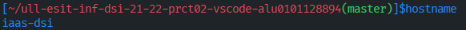
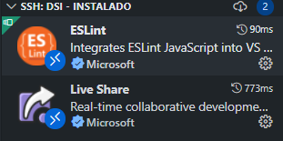
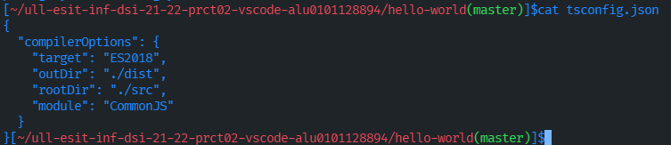
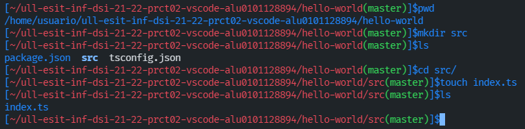
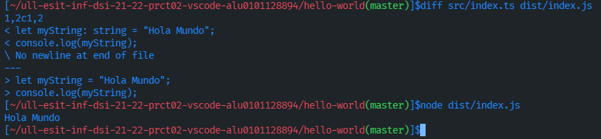

# Práctica 2 - Instalación y configuración de Visual Studio Code

## 1. Introducción
En esta segunda práctica vamos a aprender sobre distintas funcionalidades del **Visual Studio Code**. Vamos a configurar el entorno para poder trabajar cómodamente, instalando extensiones y configurando la conexión **SSH**. Y por último realizaremos una primera toma de contacto con Typescript creando un "Hola mundo".

## 2. Objetivos de la práctica
- Realizar las tareas previas
- Instalar y estudiar la funcionalidad de Visual Studio Code
- Configurar de Visual Studio Code para conectarse a una máquina remota por SSH
- Configurar las sesiones colaborativas con Visual Studio Live Share
- Desarrollar el primer proyecto en TypeScript: "Hola Mundo"

## 3. Desarrollo de la práctica
### 3.1 Instalando VS Code
Actualmente **Visual Studio Code** es uno de los entornos más populares entre los desarrolladores. Lo primero que haremos es instalarlo en nuestra máquina local. Para instalarlo, si estamos en Windows se puede descargar descargando un ejectubale y ejectuándolo. En caso contrario, si estamos en un entorno Linux, podemos realizar la instalación con estos comandos:
```bash
...$  sudo apt install code
```
También puede hacer uso de snap para instalar VSCode:
```bash
...$  sudo snap install code --classic
```


En mi caso ya tenía instalado anteriormente el VSCode, pero si es la primera vez que lo utilizas es recomendable seguir un tutorial o una **[guía](https://code.visualstudio.com/docs/editor/codebasics)** para no perderte todas sus funcionalidades al completo.

### 3.2 Conectándo remotamente utilizando VS Code
De lo primero que haremos será descargar la extensión [Remote-SSH](https://marketplace.visualstudio.com/items?itemName=ms-vscode-remote.remote-ssh). Con esta extensión nos permite conectarnos por SSH al Iaas.


Una vez instalada la extensión, en la esquina inferior izquierda, seleccionamos una cajita con unos símbolos *"><"* y buscamos la opción de **Connect to Host...**. También podemos dar click ahí o presionar **F1** para abrir la paleta de comandos y luego buscamos **ssh**. 
Si bien hemos realizado todos los pasos de la [Práctica 1](https://github.com/ULL-ESIT-INF-DSI-2122/ull-esit-inf-dsi-21-22-prct01-iaas-alu0101128894) vemos que nos va a salir nuestra máquina *dsi*. De otra forma, también lo podemos editar de forma manualmente, buscamos la opción **Configure SSH Hosts...** y elegimos la opción **~/.ssh/config**.
Y escribimos lo siguiente:
```
Host dsi
  HostName 10.6.129.113 // O bien escribimos dsi
  User usuario
```


Se puede comprobar que se nos abre una nueva ventana con la conexión SSH, de lo primero que se ve es el famoso caracterísitico prompt que previamente habiamos configurado en la práctica 1, para comprobar usamos el siguiente comando:
```bash
...$ hostname
iaas-dsi
```


### 3.3 Instalando más extensiones
Unas de las extensiones más emblemáticas es el **Live Share Extension Pack** que consiste en colaborar con otros usuarios simultaneamente en nuestro código además de poder compartir nuestros ficheros, incluso nos proporciona chat de audio y voz.

Para usar esta extensión debemos estar vinculado con la cuenta de Github o Microsoft.  Si somos el anfitrión se nos generará un link que podemos compartir a los demás participantes. Para más información visite en el [Marketplace de Live Share Extension Pack](https://marketplace.visualstudio.com/items?itemName=MS-vsliveshare.vsliveshare-pack) o en la [guía de colaboración en VS Code](https://code.visualstudio.com/learn/collaboration/live-share). 

Un detalle importante, es que cuando instalamos estas extensiones **sólo** se instalaran en la máquina en donde estamos conectados, no en el local. Para instalarlo de forma local, debemos desconectar e instalar todas sus extensiones



### 3.4 Nuestro primer "Hola mundo"
Una vez ya comenzado y preparado todo, vamos a instalar la extensión **ESLint** que comprueba el estilo del código en nuestros ficheros de js y ts. Lo instalaremos de forma global.
```bash
...$ npm install -g eslint
```
Instalamos el compilador de Typescript
```bash
...$ npm install --global typescript  // el "--global" nos permite que lo instale de forma global

// Comprobamos su versión
...$ tsc --version
```


A continuación mostraremos el directorio de nuestro directorio de práctica 2:
```bash
...$ pwd
```
Creamos una carpeta de *"hello-world"* y nos cambiamos de directorio.
```bash
...$ mkdir hello-world
...$ cd hello-world/
```
Instalamos un paquete **package.json** para establecer unas ciertas dependencias de desarrollo y ejecución del proyecto.
```bash
...$ npm init --yes

// Comprobamos que se ha creado correctamente
...$ ls -lrtha
```


Ahora abrimos el directorio *Hello-world* creado en Vscode donde podremos ver el contenido de este. Para esto vamos al menú **File** y seleccionamos la opción **Open folder...**, donde se nos mostrarán todas las carpetas seleccionando la deseada.

Ya abierto el directorio crearemos un nuevo fichero dentro de este denominado **tsconfig.json** donde se especificarán las opciones del compilador TypeScript. 
```bash
...$ touch tsconfig.json
```
Abrimos el fichero e incluimos
```
{
  "compilerOptions": {
    "target": "ES2018",
    "outDir": "./dist",
    "rootDir": "./src",
    "module": "CommonJS"
  }
}
```


Todo esto nos indica que queremos generar un código compatible con los "últimos" estándares, para ello, que el directorio sea *dist*, que los ficheros fuente estén en *src* y por último indicaremos un estándar para poder cargar los códigos desde ficheros separados. 

El fichero *src* no está creado por lo que creamos en el directorio "Hello-world"
```bash
...$ mkdir src

// Nos cambiamos a src
...$ cd src
```
Creamos el fichero de nuestro "Hola mundo":
```bash
...$ touch index.ts
...$ ls
```


Abrimos el fichero **index.ts** en el editor y ponemos estas líneas:
```typescript
let myString: string = "Hola Mundo";
console.log(myString);
```
Guardamos y ejecutamos el compilador en la terminal 
```bash
...$ tsc
```


Con ese comando se habrá creado un directorio **dist** junto a un fichero *index.ts*, comprobamos que diferencias hay entre el fichero js y el código de Typescript.
```bash
...$ diff src/index.ts dist/index.js 
```
Se puede observar que la diferencia está en la declaración del *string* ya que Typescript es un lenguaje tipado, es decir, un lenguaje que no permite la violación de datos

Comprobamos si el *Hello-word* funciona, si funciona correctamente debería salir un **"Hola mundo"**
```bash
...$ node dist/index.js
```


## 4. Conclusión de la práctica

En esta práctica ha sido una práctica no tan complicada pero si algo laborioso, se trataba de recopilar la información e imágenes necesarias para tener un buen informe, se han encontrado varios inconvenientes sobre ciertas extensiones con el entorno del Iaas, se ha trabajado nuestro primer código en Typescript y Javascript que estarán más enfocadas en las futuras elaboraciones de las prácticas.

## 5. Recursos y Webgrafía
- #### [Guión Práctica 2 DSI](https://ull-esit-inf-dsi-2122.github.io/prct02-vscode/). Instalación y configuración de Visual Studio Code
- #### [Markdown](https://guides.github.com/features/mastering-markdown/). Guía de Github sobre Markdown.
- #### [Guía sobre uso de Live Share](https://code.visualstudio.com/learn/collaboration/live-share). Guía sobre cómo usar Live Share.
- #### [VincentTam _config.yml on Github](https://github.com/daattali/beautiful-jekyll/blob/master/_config.yml). Archivo _config.yml con explicaciones.