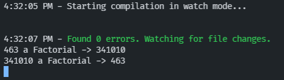
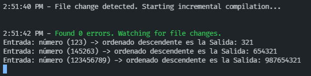
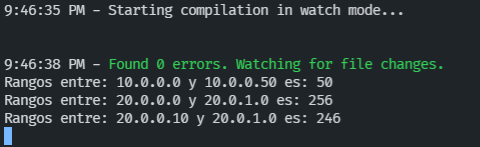
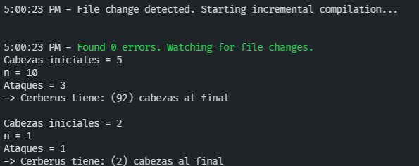

# Práctica 3 - Tipos de datos estáticos y funciones

## 1. Introducción
Para esta tercera práctica, se nos proponen **10 ejercicios** a realizar con el lenguaje **Typescript**. El objetivo es familiar con el lenguaje y aprender a manejar los distintos tipos de datos estáticos y funciones.

## 2. Pasos
Antes de realizar nuestra práctica, vamos a organizar nuestro proyecto según la [Guía de creación de proyecto](https://ull-esit-inf-dsi-2122.github.io/typescript-theory/typescript-project-setup.html).

1. Se ha de crear un fichero **tsconfig.json** añadiendo 2 líneas que el profesor nos ha recomendado en clase.

```
{
    "compilerOptions": {
      "target": "ES2018",
      "outDir": "./dist",
      "rootDir": "./src",
      "module": "CommonJS",
      "noImplicitAny": true,                   /* Expressions and declarations with an implied 'any' type. */
      "strictNullChecks": true                 /* Strict null checks. */
    }
  }
```
2. También se ha de actualizar el **package.json** agregando el uso de la *Compilación Automática*, inicializando con `npm run start`

```
{
  "name": "ull-esit-inf-dsi-21-22-prct03-types-functions-alu0101128894",
  "version": "1.0.0",
  "description": "Repositorio que contiene todo el informe desarrollado para la **Práctica 3**.",
  "main": "index.js",
  "directories": {
    "doc": "docs"
  },
  "scripts": {
    "test": "echo \"Error: no test specified\" && exit 1",
    "start": "tsc-watch --onSuccess \"node dist/ejercicio-9.js\""
  },
  "repository": {
    "type": "git",
    "url": "git+https://github.com/ULL-ESIT-INF-DSI-2122/ull-esit-inf-dsi-21-22-prct03-types-functions-alu0101128894.git"
  },
  "keywords": [],
  "author": "",
  "license": "ISC",
  "bugs": {
    "url": "https://github.com/ULL-ESIT-INF-DSI-2122/ull-esit-inf-dsi-21-22-prct03-types-functions-alu0101128894/issues"
  },
  "homepage": "https://github.com/ULL-ESIT-INF-DSI-2122/ull-esit-inf-dsi-21-22-prct03-types-functions-alu0101128894#readme",
  "devDependencies": {
    "@typescript-eslint/eslint-plugin": "^5.12.1",
    "@typescript-eslint/parser": "^5.12.1",
    "eslint": "^8.9.0",
    "eslint-config-google": "^0.14.0",
    "tsc-watch": "^4.6.0"
  }
}
```
## 3. Ejercicios propuestos.

## Ejercicio 1

[Acceso al código del ejercicio 1 (Typescript)](https://github.com/ULL-ESIT-INF-DSI-2122/ull-esit-inf-dsi-21-22-prct03-types-functions-alu0101128894/blob/master/src/ejercicio-1.ts)

En este primer ejercicios nos pide calcular que años son bisiestos y cuáles no.

```typescript
function isLeapYear(year: number): string {
  if ((year % 4) === 0) {
    if (((year % 100) != 0) || ((year % 400) === 0)) {
      return ("Es bisiesto");
    }
  }
  return ("No es bisiesto");
}

let numero1: number = 1900;
let funcion1: string = isLeapYear(numero1);
console.log(`El año "${numero1}" -> ${funcion1}`);

numero1 = 1920;
funcion1 = isLeapYear(numero1);
console.log(`El año "${numero1}" -> ${funcion1}`);
```
**SALIDA ESPERADA**
```
El año "1900" -> No es bisiesto
El año "1920" -> Es bisiesto
```
**SALIDA CORRECTAMENTE**


**EXPLICACIÓN**

La función `isLeapYear` recibe como parámetro (un número), para luego filtrarlo los años bisiestos de los no bisiestos.
Sus reglas son:
- Cada año que es divisible por 4.
  - Excepto cada año que es divisible por 100.
    - Al menos que el año también sea divisible por 400.

## Ejercicio 2

[Acceso al código del ejercicio 2 (Typescript)](https://github.com/ULL-ESIT-INF-DSI-2122/ull-esit-inf-dsi-21-22-prct03-types-functions-alu0101128894/blob/master/src/ejercicio-2.ts)

Este segundo ejercicio nos pide codificar números decimales con factoriales. Para más investigación sobre el factorial, he leído este [artículo](https://en.wikipedia.org/wiki/Factorial_number_system) y aplicamos el correspondiente algoritmo.

```typescript
function factorial(numero: number): number {
  if (numero == 0) {
    return 1;
  } else {
    return (numero * factorial(numero - 1));
  }
}

function decimalToFactorial(numero: number): string {
  let result: string = ' ';
  let cont: number = 1; // 1
  while (numero != 0) {
    result = (numero % cont).toString() + result; // convierte a string + result
    numero = Math.floor(numero / cont); // redondea más bajo
    cont++; // 1++
  }
  return result; // lo devuelve
}

function factorialToDecimal(numero: string): number {
  let result: number = 0;
  let aux: number = 0;
  for (let i: number = numero.length - 1; i >= 0; i--) { // recorre --
    result += parseInt(numero[aux]) * factorial(i); // cadena a int
    aux++;
  }
  return result;
}

let numero: number | string = 463;
let funcion2: number | string = decimalToFactorial(463);
console.log(`${numero} a Factorial -> ${funcion2}`);

numero = "341010";
funcion2 = factorialToDecimal('341010');
console.log(`${numero} a Factorial -> ${funcion2}`);
```
**SALIDA ESPERADA**
```
463 a Factorial -> 341010 
341010 a Decimal -> 463
```
**SALIDA CORRECTAMENTE**



**EXPLICACIÓN**

- La primera función `factorial` calcula el factorial de un número.

- En la segunda función `decimalToFactorial` realiza la conversión de decimal a factorial, y que su retorno debe ser una **cadena**. 
Para ello, lo que hacemos es realizar el módulo de la división entre el número decimal y sus divisores. Para entonces, el divisor debe comenzar por 1. Y su resto será el resultado en su notación.
 
  Una vez que tengamos el resto, sumamos +1 al divisor y repetimos el proceso hasta que el cociente sea 0.

- La tercera función `factorialToDecimal` realiza la conversión de factorial a decimal, pues hace lo contrario, es decir, cuando nosotros tenemos un número en notación factorial: `3 x 5! + 4 x 4! + 1 x 3! + 0 x 2! + 1 x 1! + 0 x 0!`. El valor de la derecha (___numero!___) siempre multiplica por 0! y cuando avanzamos a la izquierda lo que hace es que el valor del factorial suma 1 en 1.
  
  Se crea un valor auxiliar, y en la posición de la _derecha_ de la cadena string es la que representa el número en factorial. Pasamos el "carácter" del string a un valor númerico para así multiplicarlo con su factorial y así acumulamos todas las sumas. Se incrementa el valor del factorial y cambiamos la siguiente iteración (desplanzando una posición a la izquierda). Y todo esto se repite dependiendo del número que tengas.
  
- Una vez que tengamos el resultado, se devuelve la suma y eso exactamente es el número en decimal.

## Ejercicio 3

[Acceso al código del ejercicio 3 (Typescript)](https://github.com/ULL-ESIT-INF-DSI-2122/ull-esit-inf-dsi-21-22-prct03-types-functions-alu0101128894/blob/master/src/ejercicio-3.ts)

En este tercer ejercicio nos pide realizar un conversor de estilo. De camelCase a snake_case y al contrario.

```typescript
function fromSnakeToCamelCase(cadena: string): string {
  if (/[A-Z]/.test(cadena[0])) {                        // añadimos el test (RegExp)
    cadena = cadena.toLowerCase();                      // mayusculas a minisculas
  }
  return cadena.replace(/([_]\w)/g,
      function(coincidir: string) {
        return coincidir[1].toUpperCase();        // Ejemplo => _ejemplo (todos los matches de la cadena)
      });
}

function fromCamelToSnakeCase(cadena: string): string {
  if (/[A-Z]/.test(cadena[0])) {
    cadena = cadena.replace(cadena[0], cadena[0].toLowerCase());   // minusculas a mayusculas
  }
  return cadena.replace( /([A-Z])/g, '_$1').toLowerCase();        // _ejemplo => Ejemplo (todos los matches de la cadena)
}

let nombre: string = 'sample_string';
let funcion4: string = fromCamelToSnakeCase(nombre);
console.log(`En formato Snake "${nombre}" -> se convierte a formato Camel como: "${funcion4}"`);

nombre = 'sampleString';
funcion4 =  fromSnakeToCamelCase(nombre);
console.log(`En formato Camel "${nombre}" -> se convierte a formato Snake como: "${funcion4}"`);

nombre = 'the_stealth_warrior';
funcion4 =  fromSnakeToCamelCase(nombre);
console.log(`En formato Snake "${nombre}" -> se convierte a formato Camel como: "${funcion4}"`);

nombre = 'theStealthWarrior';
funcion4 = fromCamelToSnakeCase(nombre);
console.log(`En formato Camel "${nombre}" -> se convierte a formato Snake como: "${funcion4}"`);
```
**SALIDA ESPERADA**
```
En formato Snake "sample_string" -> se convierte a formato Camel como: "sample_string"
En formato Camel "sampleString" -> se convierte a formato Snake como: "sampleString"
En formato Snake "the_stealth_warrior" -> se convierte a formato Camel como: "theStealthWarrior"
En formato Camel "theStealthWarrior" -> se convierte a formato Snake como: "the_stealth_warrior"
```
**SALIDA CORRECTAMENTE**


**EXPLICACIÓN**
- La primera función `fromCamelToSnakeCase`, analiza la primera letra, una vez analizado. Si fuera el caso de que comienza por una mayúscula, lo cambiamos a minúscula con el *"toLowerCase"*. 
  
  Lo siguiente es reemplazar las letras mayúsculas a minúsculas precedido con un `"_"`, es decir, usamos la función **replace** con la expresión regular `/([A-Z])/g`. Lo que hace exactamente es encontrar todos los matches con letras mayúsculas de la cadena, y con el `‘_$1’`, es la cadena que debemos sustituir, es decir, estamos agregando un "_" antes de cada mayúsculas. Y transformamos todo la cadena a minúscula. Un ejemplo sería pasar de `"Hola"` a `"_hola"`.  

- La segunda función `fromSnakeToCamelCase`. Es igual que la anterior, comprobamos la primera no sea mayúsculas, usamos el **replace** de nuevo, pero la diferencia es que buscamos una expresión *precedidas* de `"_"`. Y ya en el segundo parámetro usamos la función correspondiente que devolvería la primera letra en mayúsculas.

## Ejercicio 4

[Acceso al código del ejercicio 4 (Typescript)](https://github.com/ULL-ESIT-INF-DSI-2122/ull-esit-inf-dsi-21-22-prct03-types-functions-alu0101128894/blob/master/src/ejercicio-4.ts)

En este cuarto ejercicio nos pide realizar un conversor ISBN para validar la identificación de números. Se debe cumplir con: `(x1 * 10 + x2 * 9 + x3 * 8 + x4 * 7 + x5 * 6 + x6 * 5 + x7 * 4 + x8 * 3 + x9 * 2 + x10 * 1) mod 11 == 0`. Debe estar formado por 9 dígitos y un último caracter de verificación que puede ser otro dígito o una X, que corresponde a un 10.

```typescript
function isValidISBN(cadenaISBN: string): boolean {
  cadenaISBN = cadenaISBN.replace(/[-]/g, ""); // quitar guiones
  if (cadenaISBN.length < 10) {
    return false;
  }
  let suma: number = 0;

  for (let i: number = 0; i < cadenaISBN.length; i++) {
    if (cadenaISBN[i] == "X") {
      suma = suma + (10 * (cadenaISBN.length - i));
    } else {
      suma = suma + (parseInt(cadenaISBN[i]) * (cadenaISBN.length - i));
    }
  }

  if (suma % 11 == 0) {
    return true;
  } else {
    return false;
  }
}

let cadenaISBN: string = "3-598-21508-8";
let validISBN: boolean = isValidISBN(cadenaISBN);
console.log(`¿El ISBN de "${cadenaISBN}" es válido?: ${validISBN}`);

cadenaISBN = "3598215088";
validISBN = isValidISBN(cadenaISBN);
console.log(`¿El ISBN de "${cadenaISBN}" es válido?: ${validISBN}`);

cadenaISBN = "3-598-21507-X";
validISBN = isValidISBN(cadenaISBN);
console.log(`¿El ISBN de "${cadenaISBN}" es válido?: ${validISBN}`);

cadenaISBN = "359821507X";
validISBN = isValidISBN(cadenaISBN);
console.log(`¿El ISBN de "${cadenaISBN}" es válido?: ${validISBN}`);

cadenaISBN = "3-598-21508-9";
validISBN = isValidISBN(cadenaISBN);
console.log(`¿El ISBN de "${cadenaISBN}" es válido?: ${validISBN}`);
```
**SALIDA ESPERADA**
```
¿El ISBN de "3-598-21508-8" es válido?: true
¿El ISBN de "3598215088" es válido?: true
¿El ISBN de "3-598-21507-X" es válido?: true
¿El ISBN de "359821507X" es válido?: true
¿El ISBN de "3-598-21508-9" es válido?: false
```
**SALIDA CORRECTAMENTE**


**EXPLICACIÓN**

- En la función `isValidISBN` recibe un parámetro una cadena de texto que se representaría como ISBN, y devolverá un *true o false*. Lo primero que hacemos es quitar los guiones, para ello, usamos el `replace(/[-]/g, "")`. Declaramos una variable "suma" que se iría almacenando en un for y avanzando en la cadena, utilizando la formula para que sea válido o no: `(x1 * 10 + x2 * 9 + x3 * 8 + x4 * 7 + x5 * 6 + x6 * 5 + x7 * 4 + x8 * 3 + x9 * 2 + x10 * 1) mod 11 == 0`.

- Se va analizando posición a posición y comprueba si la cadena "X" ya que representa un 10 y se multiplicaría por su número correspondiente. Si llega el caso de que no encuentra una "X", se pasa al número que se encuentra en la cadena y se va a multiplicar por el número correspondiente y se irá sumando en cada iteración

- Una vez finalizado, si el resultado es divisible por 11, el ISBN es válido, y retornaría un true, en caso contrario, no sería válido y retornaría un false

## Ejercicio 5

[Acceso al código del ejercicio 5 (Typescript)](https://github.com/ULL-ESIT-INF-DSI-2122/ull-esit-inf-dsi-21-22-prct03-types-functions-alu0101128894/blob/master/src/ejercicio-5.ts)

En este quinto ejercicio nos pide realizar una función que recibe un entero no negativo como argumento y devuelva otro entero construido a partir de los dígitos ordenados de manera descendente.

```typescript
function sortArray(numero: number) {
  return Number(numero.toString().split('').sort((a: string, b: string) => parseInt(b) - parseInt(a)).join(''));
}
const array1: number = 123;
const array2: number = 145263;
const array3: number = 123456789;

console.log(`Entrada: número (${array1}) -> ordenado descendente es la Salida: ` + sortArray(123));
console.log(`Entrada: número (${array2}) -> ordenado descendente es la Salida: ` + sortArray(145263));
console.log(`Entrada: número (${array3}) -> ordenado descendente es la Salida: ` + sortArray(123456789));
```
**SALIDA ESPERADA**
```
Entrada: número (123) -> ordenado descendente es la Salida: 321
Entrada: número (145263) -> ordenado descendente es la Salida: 654321
Entrada: número (123456789) -> ordenado descendente es la Salida: 987654321

```
**SALIDA CORRECTAMENTE**



**EXPLICACIÓN**
- Tenemos una funcion `sortArray` que devuelve un número a calcular, en este caso, convertimos el número a una cadena de string y lo dividimos con "comas". Una vez realizado ello. Tenemos un vector formado con comas, y lo ordenamos con el *sort*  de manera decreciente, para ello hacemos un return b-a, conviertiendo de string a entero. Ya que el valor que debemos devolver son números, una vez realizado la conversión tenemos ya el vector ordenado de manera decreciente y lo unimos con un "join". 

  Por ejemplo si tenemos el número de "123" se convertirá a [1,2,3], lo ordenamos decreciente y quedaría tal que: [3,2,1] y despues usamos el join y nos quedaría la solución final: **321**

## Ejercicio 6

[Acceso al código del ejercicio 6 (Typescript)](https://github.com/ULL-ESIT-INF-DSI-2122/ull-esit-inf-dsi-21-22-prct03-types-functions-alu0101128894/blob/master/src/ejercicio-6.ts)

En este sexto ejercicio nos pide realizar contar IP's, una función que reciba un parámetro de dos cadenas y que devuelva un valor númerico que representa el número de IP's disponibles en su rango correspondiente.

```typescript
function ip2int(ip: string): number {
  let ipSeparar: string[] = ip.split('.'); // separamos los puntos
  let result: number = 0;
  for (let i: number = 3; i >= 0; i--) {
    result += parseInt(ipSeparar[i]) * Math.pow(256, 3 - i); // 256 direcciones, derecha = 0, izquierda = 3
  }
  return result;
}

function ipsInRange(ipInicio: string, ipFinal: string): number {
  let ip1: number = ip2int(ipInicio);
  let ip2: number = ip2int(ipFinal);
  if (ip1 > ip2) {
    [ip1, ip2] = [ip2, ip1];
  }
  return (ip2 - ip1);
}

const ip1: string = "10.0.0.0";
const ip2: string = "10.0.0.50";
const solRange = ipsInRange(ip1, ip2);
console.log(`El rango de: ${ip1} y ${ip2} es: ${solRange}`);

const ip3: string = "20.0.0.0";
const ip4: string = "20.0.1.0";
const solRange1 = ipsInRange(ip3, ip4);
console.log(`El rango de: ${ip3} y ${ip4} es: ${solRange1}`);

const ip5: string = "20.0.0.10";
const ip6: string = "20.0.1.0";
const solRange2 = ipsInRange(ip5, ip6);
console.log(`El rango de: ${ip5} y ${ip6} es: ${solRange2}`);
```
**SALIDA ESPERADA**
```
Rangos entre: 10.0.0.0 y 10.0.0.50 es: 50
Rangos entre: 20.0.0.0 y 20.0.1.0 es: 256
Rangos entre: 20.0.0.10 y 20.0.1.0 es: 246
```
**SALIDA CORRECTAMENTE**



**EXPLICACIÓN**

- Se han realizado dos funciones, `ip2int` y `ipsInRange`. En `ip2int` pasa la dirección por un número haciendo un uso de los separadores los puntos. Cada uno de los "4" octetos de las IPS es igual a 256 direcciones, es decir, necesitamos que cada octeto lo multiplique por 256 elevado a su posición, siendo en este caso, la derecha un 0, y la izquierda un 3

- En la función `ipsInRange`, se averigua que dirección es mayor que la otra para evitar que la resta nos de un número negativo y obtenemos las IP en el rango adecuado.

## Ejercicio 7

[Acceso al código del ejercicio 7 (Typescript)](https://github.com/ULL-ESIT-INF-DSI-2122/ull-esit-inf-dsi-21-22-prct03-types-functions-alu0101128894/blob/master/src/ejercicio-7.ts)

En este séptimo ejercicio nos pide calcular una función que dado el número inicial de cabezas que tiene el Cerberus, el valor de n, así como la cantidad de ataques que Diana va a realizar, devuelva el número de cabezas que el Cerberus tendrá al final de los ataques.

```typescript

function wonderWoman(cabezas: number, n: number, ataques: number): number {
  let cabezasN: number = n; // n cabezas
  let valor1: number = 1;

  for (let i: number = 1; i <= ataques; i++) {
    cabezas--; // decreciente
    for (valor1 = 1; valor1 <= i; valor1++) { // recorre
      cabezasN *= valor1; // actualiza el valor n cabezas y lo multiplica
    }
    cabezas += cabezasN; // suma n cabezas
    cabezasN = n;
  }
  return cabezas;
};

console.log('Cabezas iniciales = 5\nn = 10\nAtaques = 3\n-> Cerberus tiene: (' + wonderWoman(5, 10, 3) + ') cabezas al final\n');
console.log('Cabezas iniciales = 2\nn = 1\nAtaques = 1\n-> Cerberus tiene: (' + wonderWoman(2, 1, 1) + ') cabezas al final');

console.log('Cabezas iniciales = 5\nn = 10\nAtaques = 3\n-> Cerberus tiene: (' + wonderWoman(5, 10, 3) + ') cabezas al final\n');
console.log('Cabezas iniciales = 2\nn = 1\nAtaques = 1\n-> Cerberus tiene: (' + wonderWoman(2, 1, 1) + ') cabezas al final');
```
**SALIDA ESPERADA**
```
Cabezas iniciales = 5
n = 10
Ataques = 3
-> Cerberus tiene: (92) cabezas al final

Cabezas iniciales = 2
n = 1
Ataques = 1
-> Cerberus tiene: (2) cabezas al final
```
**SALIDA CORRECTAMENTE**



**EXPLICACIÓN**

- Tenemos una función `wonderWoman` que recibe como parámetros una *cabeza inicial, n cabezas, y ataques*. Recorremos el bucle for para que sean menores iguales que ataques así podremos buscar los valores correspondientes. 

  Empezamos iterando decreciente las cabezas iniciales, así recorriendo en el bucle for con un **valor = 1** va recorriendo. Actualizamos el valor de las n cabezas por valor = 1 y lo multiplica. 

  Una vez reccorido el bucle for, sumamos los numeros de cabezas por su cabezas que hayamos puesto en el parámetro y al final devolvemos las cabezas.

## Ejercicio 8

[Acceso al código del ejercicio 8 (Typescript)](https://github.com/ULL-ESIT-INF-DSI-2122/ull-esit-inf-dsi-21-22-prct03-types-functions-alu0101128894/blob/master/src/ejercicio-8.ts)

En este octavo ejercicio nos pide calcular un combate pokemon cuya fórmula es: `daño = 50 * (ataque / defensa) * efectividad`

```typescript
function combatePokemon(tipoPokemon1: string, tipoPokemon2: string,
    ataque: number, defensa: number): number {
  let efectividad: number = 0;
  if (tipoPokemon1 === tipoPokemon2) {
    efectividad = 0.5;
  } else if (tipoPokemon1 === 'Fuego') {
    switch (tipoPokemon2) {
      case 'Hierba':
        efectividad = 2;
        break;
      case 'Electrico':
        efectividad = 1;
        break;
      case 'Agua':
        efectividad = 0.5;
        break;
    }
  } else if (tipoPokemon1 === 'Agua') {
    switch (tipoPokemon2) {
      case ('Hierba' || 'Electrico'):
        efectividad = 0.5;
        break;
      case 'Fuego':
        efectividad = 2;
        break;
    }
  } else if (tipoPokemon1 === 'Electrico') {
    switch (tipoPokemon2) {
      case ('Fuego' || 'Hierba)'):
        efectividad = 1;
        break;
      case 'Agua':
        efectividad = 2;
        break;
    }
  } else {
    switch (tipoPokemon2) { // Hierba
      case 'Electrico':
        efectividad = 1;
        break;
      case 'Agua':
        efectividad = 2;
        break;
      case 'Fuego':
        efectividad = 0.5;
        break;
    }
  }
  let daño: number = 50 * (ataque / defensa) * efectividad;
  return daño;
}

console.log('Pokemon 1 [Electrico] (Ataque: 54) VS Pokemon 2 [Agua] (Defensa: 46) -> Daño: ' +
  combatePokemon('Electrico', 'Agua', 54, 46));

console.log('Pokemon 3 [Agua] (Ataque: 2) VS Pokemon 4 [Hierba] (Defensa: 7) -> Daño: ' +
  combatePokemon('Agua', 'Hierba', 2, 7));

console.log('Pokemon 5 [Fuego] (Ataque: 2) VS Pokemon 6 [Fuego] (Defensa: 1) -> Daño: ' +
  combatePokemon('Fuego', 'Fuego', 2, 1));
```
**SALIDA ESPERADA**
```
Pokemon 1 [Electrico] (Ataque: 54) VS Pokemon 2 [Agua] (Defensa: 46) -> Daño: 117.3913043478261
Pokemon 3 [Agua] (Ataque: 2) VS Pokemon 4 [Hierba] (Defensa: 7) -> Daño: 7.142857142857142
Pokemon 5 [Fuego] (Ataque: 2) VS Pokemon 6 [Fuego] (Defensa: 1) -> Daño: 50
```
**SALIDA CORRECTAMENTE**


**EXPLICACIÓN**

- Tenemos una función `combatePokemon` y le pasamos como parámetro el (tipo de pokemon "atacante") y el (tipo de pokemon "defensor") como *cadenas de strings*. Y el ataque del atacante y la defensa del defensor como *números*

- Los valores de efectividad depende de los tipos que hayamos elegido, en este caso son:
```
fuego > hierba
fuego < agua
fuego = eléctrico
agua < hierba
agua < eléctrico
hierba = eléctrico
```
- El primer caso es que ambos sean del mismo tipo, es ese caso, la efectividad sea neutra, es decir, 1. Si no fuera el caso, vamos seleccionando uno a uno con if's del primer pokemon y dentro de cada if, tenemos un switch que asignará a cada tipo de efectividad del pokemon defensor

- Una vez realizado la efectividad, usaramos la fórmula: `daño = 50 * (ataque/defensa) * efectividad` y nos devuelve una operación en decimales que es la solución correspondiente a nuestro problema.

## Ejercicio 9

[Acceso al código del ejercicio 9 (Typescript)](https://github.com/ULL-ESIT-INF-DSI-2122/ull-esit-inf-dsi-21-22-prct03-types-functions-alu0101128894/blob/master/src/ejercicio-9.ts)

En este noveno ejercicio nos pide calcular de decimal a romano, y de romano a decimal. Para más investigación sobre el romano, he leído este [artículo.](https://es.wikipedia.org/wiki/Numeraci%C3%B3n_romana)

```typescript
function romanNumbers (numero: string): number {
  let resultado: number = 0;
  switch (numero) {
    case 'M':
      resultado = 1000;
      break;
    case 'D':
      resultado = 500;
      break;
    case 'C':
      resultado = 100;
      break;
    case 'L':
      resultado = 50;
      break;
    case 'X':
      resultado = 10;
      break;
    case 'V':
      resultado = 5;
      break;
    case 'I':
      resultado = 1;
      break;
  }
  return resultado;
};
function romanToDecimal(cadena: string): number {
  let numero: number = 0;

  for (let i: number = 0; i < cadena.length; i++) {
    let actual: string = cadena[i];
    let despues: string = cadena[i + 1];
    if (romanNumbers(despues) > romanNumbers(actual)) {
      numero += romanNumbers(despues) - romanNumbers(actual);
      i++;
    } else {
      numero += romanNumbers(actual);
    }
  }
  return numero;
}

function decimalToRoman(numero: number): string {
  let result: string = "";
  const numeros: number [] = [1000, 900, 500, 400, 100, 90, 50, 40, 10, 9, 5, 4, 1];
  const romanos: string [] = ["M", "CM", "D", "CD", "C", "XC", "L", "XL", "X", "IX", "V", "IV", "I"];
  for (let i: number = 0; numero; i++) {
    while (numero >= numeros[i]) {
      result += romanos[i];
      numero -= numeros[i];
    }
  }
  return result;
}

console.log('El número romano -> "' + decimalToRoman(10) + '" es equivalente al número entero en base decimal 10.');
console.log('El número romano -> "' + decimalToRoman(50) + '" es equivalente al número entero en base decimal 50.');
console.log('El número romano -> "' + decimalToRoman(1995) + '" es equivalente al número entero en base decimal 1995.');

console.log('El número entero en base decimal -> "' + romanToDecimal('X') + '" es equivalente al número romano X.');
console.log('El número entero en base decimal -> "' + romanToDecimal('C') + '" es equivalente al número romano C.');
console.log('El número entero en base decimal -> "' + romanToDecimal('MCMXCV') + '" es equivalente al número romano MCMXCV.');
```
**SALIDA ESPERADA**
```
El número romano -> "X" es equivalente al número entero en base decimal 10.
El número romano -> "L" es equivalente al número entero en base decimal 50.
El número romano -> "MCMXCV" es equivalente al número entero en base decimal 1995.
El número entero en base decimal -> "10" es equivalente al número romano X.
El número entero en base decimal -> "100" es equivalente al número romano C.
El número entero en base decimal -> "1995" es equivalente al número romano MCMXCV.
```
**SALIDA CORRECTAMENTE**


**EXPLICACIÓN**

- En la primera función `romanToDecimal`, le pasamos como parámetro una cadena de string. Agregamos una función `romanNumbers` únicamente para seleccionar cada case con su valor correspondiente. Recorremos la cadena en un bucle for y seleccionamos la primera posición de la cadena "actual" y también seleccionamos la siguiente posición de la cadena "después". Comparamos con la funció `romanNumbers` si es mayor que la cadena actual y actualizamos el valor restándolo a la cadena actual y seguimos iterando el bucle. 
  
  En caso contrario actualizamos el valor del actual sin iterarlo.

- En la segunda función `decimalToRoman`, le pasamos como parámetro un número, guardamos en 2 constantes, los números y los romanos. Recorremos los números en un bucle for y comparamos si mientras el número es >= a la cadena de números, nos devuelva el resultado como cadena vacía + la cadena de romanos. Y también el número restándole la cadena de números. Y a todo eso, retornamos el valor del resultado.

## Ejercicio 10

[Acceso al código del ejercicio 10 (Typescript)](https://github.com/ULL-ESIT-INF-DSI-2122/ull-esit-inf-dsi-21-22-prct03-types-functions-alu0101128894/blob/master/src/ejercicio-10.ts)

En este décimo ejercicio nos pide una función que reciba dos puntos como argumentos, que tengan el mismo número de coordenadas (n números enteros) y que devuelva la distancia de Manhattan entre ambos puntos utilizando la distancia de Manhattan. Para más investigación sobre la distancia de Manhattan, he leído este [artículo](https://es.wikipedia.org/wiki/Geometr%C3%ADa_del_taxista)

```typescript
function distanciaManhattan(camino1: number[], camino2: number[]): number {
  let resultado: number = 0;

  for (let i: number = 0; i < camino1.length; i++) {
    resultado += Math.abs(camino1[i] - camino2[i]);
  }
  return resultado;
};
const resultado1: number = distanciaManhattan([1, 2], [2, 3]);
const resultado2: number = distanciaManhattan([2, 2], [5, 6]);

console.log(`Distancia de Manhattan entre [1, 2], [2, 3]: ${resultado1}`);
console.log(`Distancia de Manhattan entre [2, 2], [5, 6]: ${resultado2}`);
```
**SALIDA ESPERADA**
```
Distancia de Manhattan entre [1, 2], [2, 3]: 2
Distancia de Manhattan entre [2, 2], [5, 6]: 7
```
**SALIDA CORRECTAMENTE**


**EXPLICACIÓN**

- Tenemos una función `distanciaManhattan` que devuelve 2 arrays de números, en este caso aplicamos una formula: `|camino1| - |camino2|` y calculamos las distancias de cada uno.

- En el bucle for recorremos toda la longitud del camino 1 que le hayamos pasado, y como resultado hacemos el valor absulto del primer camino menos el valor absoluto del segundo camino. Con ello, tenemos la distancia de Manhattan o también llamado **"Geometría del taxista"**.

## 4. Conclusión

Como conclusión de esta práctica podemos decir que hemos aprendido a crear nuestra primera estructura de proyecto y hemos empezado a desarrollar una serie de ejercicios en lenguaje Typescript aprendiendo a usar distintos tipos estáticos y de funciones. 

Cabe destacar el uso de expresiones regulares que hace el trabajo más notorio. En cada unos de los ejercicios tenían su dificultad, pero para una práctica "3", está super interesante. Unos de los ejercicios más complejos que he realizado ha sido el ejercicio 6 pues habian muchas formas de realizarlo y puesto podías cometer un error. 

La siguiente práctica será super parecida a este, utilizando las pruebas unitarias y generando una documentación automática.

## 5. Recursos y Webgrafía

- [Guión práctica 3](https://ull-esit-inf-dsi-2122.github.io/prct03-types-functions/). Guión de la práctica
- [Regex101](https://regex101.com/). Expresiones Regulares
- [Sistema factorial](https://en.wikipedia.org/wiki/Factorial_number_system) 
- [Números Romanos](https://es.wikipedia.org/wiki/Numeraci%C3%B3n_romana) 
- [Distancia de Manhattanl](https://es.wikipedia.org/wiki/Geometr%C3%ADa_del_taxista)
- [Métodos de String](https://www.w3schools.com/js/js_string_methods.asp)