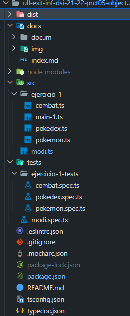
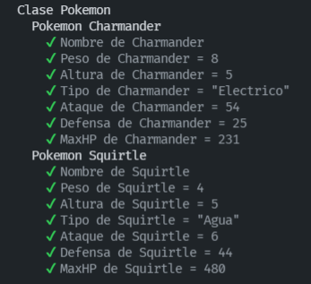
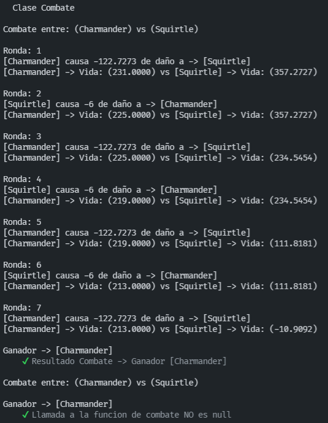

# Práctica 5 - Objetos, clases e interfaces

## 1. Introducción

Para esta quinta práctica nos pide realizar haciendo un uso de objetos, clases e interfaces. Se tratará de dos ejercicios pero algo más complejos. Seguimos usando la misma metodología TDD, así como la generación de documentación gracias a Typedoc.

## 2. Pasos

Antes de realizar nuestra práctica, reorganizaremos nuestro proyecto según la [Guía de creación de proyecto](https://ull-esit-inf-dsi-2122.github.io/typescript-theory/typescript-project-setup.html) y modificaremos un poco la estructura del trabajo organizando un directorio independiente para cada ejercicio y dentro de ese directorio un fichero independiente para cada clase. Quedaría tal que así:



## 3. Desarrollo de la práctica

**[Acceso a la documentación generada con Typedoc.](https://github.com/ULL-ESIT-INF-DSI-2122/ull-esit-inf-dsi-21-22-prct05-objects-classes-interfaces-alu0101128894/tree/master/docum)**

**[Acceso al directorio de código fuente (src).](https://github.com/ULL-ESIT-INF-DSI-2122/ull-esit-inf-dsi-21-22-prct05-objects-classes-interfaces-alu0101128894/tree/master/src)**

**[Acceso al directorio de pruebas unitarias (Tests).](https://github.com/ULL-ESIT-INF-DSI-2122/ull-esit-inf-dsi-21-22-prct05-objects-classes-interfaces-alu0101128894/tree/master/tests)**

**[Guión de la práctica 5.](https://ull-esit-inf-dsi-2122.github.io/prct05-objects-classes-interfaces/)**

## Ejercicio 1 - Pokedex

Nos organizaremos en varias clases, la clase **Pokemon**, la clase **Combate** y la clase **Pokedex**

### 1. Clase Pokemon

[Acceso al código de la clase Pokemon (Typescript).](https://github.com/ULL-ESIT-INF-DSI-2122/ull-esit-inf-dsi-21-22-prct05-objects-classes-interfaces-alu0101128894/blob/master/src/ejercicio-1/pokemon.ts)

[Acceso a las pruebas de de la clase Pokemon.](https://github.com/ULL-ESIT-INF-DSI-2122/ull-esit-inf-dsi-21-22-prct05-objects-classes-interfaces-alu0101128894/blob/master/tests/ejercicio-1-tests/pokemon.spec.ts)

Cada pokemon tiene una serie de atributos, el nombre, el peso y altura, el tipo y sus 4 características básicas: ataque, defensa, velocidad y salud. Entonces por ello, implementamos estas características como atributos privados de la clase. Además mencionar que hay una variable nueva para agregar la vida restante después de cada ataque del pokemon.

```ts
export class Pokemon {
  private nombre: string;
  private peso: number;
  private altura: number;
  private tipo: string;
  private estadistica = new Array(4);
  public hpCombate: number = 0;

  constructor(
      nombreEntrada: string,
      pesoEntrada: number,
      alturaEntrada: number,
      tipoEntrada: string,
      statsEntrada: number[]) {
    this.nombre = nombreEntrada;
    this.peso = pesoEntrada;
    this.altura = alturaEntrada;
    this.tipo = tipoEntrada;
    this.estadistica = statsEntrada;
    this.hpCombate = this.estadistica[3];
  }

  getNombre() {
    return this.nombre;
  }
  getPeso() {
    return this.peso;
  }
  getAltura() {
    return this.altura;
  }
  getTipo() {
    return this.tipo;
  }
  getAtaque() {
    return this.estadistica[0];
  }
  getDefensa() {
    return this.estadistica[1];
  }
  getMaxHP() {
    return this.estadistica[3];
  }
};
```

Y también tenemos una función para mostrar los datos del Pokemon de cada uno.

```ts
showData() {
    console.log("Pokemon [" + this.getNombre() + "] Tipo: [" + this.getTipo() + "] Ataque: (" + this.getAtaque() + ") Defensa: (" +
    this.getDefensa() + ") HP: (" + this.getMaxHP() + ")");
  }
```

Con esta primera parte de la clase Pokemon, podemos representar a cualquier pokemon que deseamos.

**TESTS REALIZADOS**

```ts
describe('Clase Pokemon', () => {
  const pokemon1: Pokemon = new Pokemon("Charmander", 8, 5, "Electrico", [54, 25, 7, 231]);
  const pokemon2: Pokemon = new Pokemon("Squirtle", 4, 3, "Agua", [6, 44, 3, 480]);

  describe('Pokemon Charmander', () => {
    it('Nombre de Charmander', () => {
      expect(pokemon1.getNombre()).to.be.equal("Charmander");
    });
    it('Peso de Charmander = 8', () => {
      expect(pokemon1.getPeso()).to.be.equal(8);
    });
    it('Altura de Charmander = 5', () => {
      expect(pokemon1.getAltura()).to.be.equal(5);
    });
    it('Tipo de Charmander = "Electrico"', () => {
      expect(pokemon1.getTipo()).to.be.equal("Electrico");
    });
    it('Ataque de Charmander = 54', () => {
      expect(pokemon1.getAtaque()).to.be.equal(54);
    });
    it('Defensa de Charmander = 25', () => {
      expect(pokemon1.getDefensa()).to.be.equal(25);
    });
    it('MaxHP de Charmander = 231', () => {
      expect(pokemon1.getMaxHP()).to.be.equal(231);
    });
  });

  describe('Pokemon Squirtle', () => {
    it('Nombre de Squirtle', () => {
      expect(pokemon2.getNombre()).to.be.equal("Squirtle");
    });
    it('Peso de Squirtle = 4', () => {
      expect(pokemon2.getPeso()).to.be.equal(4);
    });
    it('Altura de Squirtle = 5', () => {
      expect(pokemon2.getAltura()).to.be.equal(3);
    });
    it('Tipo de Squirtle = "Agua"', () => {
      expect(pokemon2.getTipo()).to.be.equal("Agua");
    });
    it('Ataque de Squirtle = 6', () => {
      expect(pokemon2.getAtaque()).to.be.equal(6);
    });
    it('Defensa de Squirtle = 44', () => {
      expect(pokemon2.getDefensa()).to.be.equal(44);
    });
    it('MaxHP de Squirtle = 480', () => {
      expect(pokemon2.getMaxHP()).to.be.equal(480);
    });
  });
});
```
**SALIDA CORRECTAMENTE**



### 2. Clase Combate

[Acceso al código de la clase Combate (Typescript).](https://github.com/ULL-ESIT-INF-DSI-2122/ull-esit-inf-dsi-21-22-prct05-objects-classes-interfaces-alu0101128894/blob/master/src/ejercicio-1/combat.ts)

[Acceso a las pruebas de de la clase Combate.](https://github.com/ULL-ESIT-INF-DSI-2122/ull-esit-inf-dsi-21-22-prct05-objects-classes-interfaces-alu0101128894/blob/master/tests/ejercicio-1-tests/combat.spec.ts)

Continuando con la clase Combate se declara dos métodos privados para los dos pokemoms de clase Pokemon. Así como un array de 2 para almacenar los dos tipos de datos de los pokemons.

```ts
export class Combate {
  private pokemon1: Pokemon;
  private pokemon2: Pokemon;

  private datos: number[] = new Array(2);

  constructor(
      pokemon1: Pokemon,
      pokemon2: Pokemon) {
    this.pokemon1 = pokemon1;
    this.pokemon2 = pokemon2;
  }
```

En la clase Combate, almacenaremos los dos pokemons del combate de la clase, además de eso, almacenamos **tercer atributo**: Un array de dos elementos en la que guardamos el daño que realiza cada pokemon en base al tipo de cada uno y su efectividad.

```ts
calculoCombate(tipoPokemon1: string, tipoPokemon2: string, ataque: number, defensa: number): number {
    let efectividad: number = 0;
    if (tipoPokemon1 === tipoPokemon2) {
      efectividad = 0.5;
    } else if (tipoPokemon1 === 'Fuego') {
      switch (tipoPokemon2) {
        case 'Hierba':
          efectividad = 2;
          break;
        case 'Electrico':
          efectividad = 1;
          break;
        case 'Agua':
          efectividad = 0.5;
          break;
      }
    } else if (tipoPokemon1 === 'Agua') {
      switch (tipoPokemon2) {
        case ('Hierba'):
        case ('Electrico'):
          efectividad = 0.5;
          break;
        case 'Fuego':
          efectividad = 2;
          break;
      }
    } else if (tipoPokemon1 === 'Electrico') {
      switch (tipoPokemon2) {
        case ('Fuego'):
        case ('Hierba)'):
          efectividad = 1;
          break;
        case 'Agua':
          efectividad = 2;
          break;
      }
    } else {
      switch (tipoPokemon2) {
        case 'Electrico':
          efectividad = 1;
          break;
        case 'Agua':
          efectividad = 2;
          break;
        case 'Fuego':
          efectividad = 0.5;
          break;
      }
    }
    let daño: number = 50 * (ataque/defensa) * efectividad;
    return parseFloat(daño.toFixed(4));
  }
```
Entonces, en la "simulación de combate", ataca primero el que está en primer parámetro, entonces, mientras unos de los dos pokemons esté vivo, hacemos ataques por turnos (mostrando los ataques y daños) y cuando acabe el combate, se muestra y retorna al ganador del pokemon.

Todo este procedimiento está en la función `combatePokemon();`

```ts
combatePokemon(): Pokemon {
  this.datos[0] = this.calculoCombate(this.pokemon1.getTipo(), this.pokemon2.getTipo(), this.pokemon1.getAtaque(), this.pokemon2.getDefensa());
  this.datos[1] = this.calculoCombate(this.pokemon2.getTipo(), this.pokemon1.getTipo(), this.pokemon2.getAtaque(), this.pokemon1.getDefensa());
  let iterador: number = 1;
  console.log("\nCombate entre: (" + this.pokemon1.getNombre() + ") vs (" + this.pokemon2.getNombre() +")");

  while ((this.pokemon1.hpCombate > 0) && (this.pokemon2.hpCombate > 0)) {
    console.log("\nRonda: " + iterador);
    if ((iterador % 2) == 0) {
      console.log("[" + this.pokemon2.getNombre() + "] causa -" + this.datos[1] + " de daño a -> [" + this.pokemon1.getNombre() + "]");
      this.pokemon1.hpCombate -= this.datos[1];
    } else {
      console.log("[" + this.pokemon1.getNombre() + "] causa -" + this.datos[0] + " de daño a -> [" + this.pokemon2.getNombre() + "]");
      this.pokemon2.hpCombate -= this.datos[0];
    }
    iterador++;
    console.log("[" + this.pokemon1.getNombre() + "] -> Vida: (" + (this.pokemon1.hpCombate).toFixed(4) + ") vs [" + this.pokemon2.getNombre() +
    "] -> Vida: (" + (this.pokemon2.hpCombate).toFixed(4) + ")");
  }
  console.log("\nGanador -> [" + (this.pokemon1.hpCombate <= 0 ? this.pokemon2.getNombre() : this.pokemon1.getNombre()) + "]");

  if (this.pokemon1.hpCombate <= 0) {
    return this.pokemon2;
  } else {
    return this.pokemon1;
  }
}
```
**TESTS REALIZADOS**
```ts
describe('Clase Combate', () => {
  const pokemon1: Pokemon = new Pokemon("Charmander", 8, 5, "Electrico", [54, 25, 7, 231]);
  const pokemon2: Pokemon = new Pokemon("Squirtle", 4, 3, "Agua", [6, 44, 3, 480]);
  const combate: Combate = new Combate(pokemon1, pokemon2);

  it("Resultado Combate -> Ganador [Charmander]", () => {
    expect(combate.combatePokemon()).to.equal(pokemon1);
  });

  it('Llamada a la funcion de combate NO es null', () => {
    expect(combate.combatePokemon()).not.to.be.equal(null);
  });
});
```
**SALIDA CORRECTAMENTE**



### 3. Clase Pokedex

[Acceso al código de la clase Pokedex (Typescript).](https://github.com/ULL-ESIT-INF-DSI-2122/ull-esit-inf-dsi-21-22-prct05-objects-classes-interfaces-alu0101128894/blob/master/src/ejercicio-1/pokedex.ts)

[Acceso a las pruebas de de la clase Pokedex.](https://github.com/ULL-ESIT-INF-DSI-2122/ull-esit-inf-dsi-21-22-prct05-objects-classes-interfaces-alu0101128894/blob/master/tests/ejercicio-1-tests/pokedex.spec.ts)

En esta última parte es un almacenamiento para distintos Pokemons, en la que como las anteriores clases, será de un arrays de Pokemons. En la que nos podemos encontrar una función para añadir pokemons, eliminar Pokemons, el tamaño del Pokemon y una búsqueda de Pokemon.

```ts
export class Pokedex {
  private basePokemon: Pokemon[] = [];
  constructor() {};

  public añadirPokemon(pokemon: Pokemon) { // añadir Pokemon
    this.basePokemon.push(pokemon);
  }

  public eliminarPokemon(pokemon: Pokemon) { // eiminar Pokemon
    let posicion: number = -1;
    this.basePokemon.forEach((iterador) => {
      if (iterador === pokemon) {
        posicion = this.basePokemon.indexOf(iterador);
      }
    });
    if (posicion == -1) {
      console.log('Pokemon no encontrado');
    } else {
      this.basePokemon.splice(posicion, 1);
    }
  };

  public pokedexSize(): number { // Tamaño del Pokemon
    return this.basePokemon.length;
  }

  public buscarPokemon(pokemon: Pokemon) { // Buscar el Pokemon Pokemon
    let posicion: number = -1;
    this.basePokemon.forEach((iterador) => {
      if (iterador === pokemon) {
        posicion = this.basePokemon.indexOf(iterador);
      }
    });
    if (posicion == -1) {
      return null;
    } else {
      return this.basePokemon[posicion];
    }
  }
};
```

**TESTS REALIZADOS**
```ts
describe('Clase Pokedex', () => {
  const pokemon1: Pokemon = new Pokemon("Charmander", 8, 5, "Electrico", [54, 25, 7, 231]);
  const pokemon2: Pokemon = new Pokemon("Squirtle", 4, 3, "Agua", [6, 44, 3, 480]);
  const pokemon3: Pokemon = new Pokemon("Charizard", 10, 2, "Agua", [52, 34, 70, 241]);

  const pokedex: Pokedex = new Pokedex();

  pokedex.añadirPokemon(pokemon1);
  pokedex.añadirPokemon(pokemon2);
  pokedex.añadirPokemon(pokemon3);
  pokedex.eliminarPokemon(pokemon2);

  it('AñadirPokemon (Pokemon1)', () => {
    expect(pokedex.añadirPokemon(pokemon1)).not.to.be.equal(null);
  });
  it('EliminarPokemon (Pokemon2)', () => {
    expect(pokedex.eliminarPokemon(pokemon2)).not.to.be.equal(null);
  });
  it("BuscarPokemon (Pokemon1) devuelve Pokemon1 -> [Charmander]", () => {
    expect(pokedex.buscarPokemon(pokemon1)).to.be.equal(pokemon1);
  });
  it("Tamaño del Pokemon", () => {
    expect(pokedex.pokedexSize()).to.be.equal(3);
  });
});
```
**SALIDA CORRECTAMENTE**


## Ejercicio 2 - Conecta 4

## 4. Conclusión
Ya poco a poco vamos notando cómo la complejidad de las prácticas aumenta. Aunque ciertamente no es nada excesivamente complicado, algunos aspectos se me \"atragantaron\". Esto lo he podido notar en la correción presencial ya que, aunque el ejercicio no fue en absoluto dificil, tuve algunos problemas al inicio del ejercicio. Por ello me he dado cuenta de que debo profundizar más en los conceptos de TDD. 

Además, cabe destacar que este tipo de ejercicios, con planteamientos tan amenos y dinámicos hace que la realización de las prácticas sea mucho más llevadera.

## 4. Conclusión

Se va notando poco a poco la dificultad de esta práctica, aunque he tenido algunos imprevistos como por ejemplo, los problemas en el TDD y también la lógica de Typescript. Sobre todo lo demás está práctica se hace un uso muy extensivo sobre las pruebas unitarias y la verdad es que me gustó trabajar sobre ello. Asi que por lo general estoy satisfecho con mi trabajo.

## 5. Recursos y Webgrafía

- [Guión práctica 5](https://ull-esit-inf-dsi-2122.github.io/prct05-objects-classes-interfaces/). Guión de la práctica
- [Apuntes sobre objetos, clases e interfaces](https://ull-esit-inf-dsi-2122.github.io/typescript-theory/typescript-objects-classes-interfaces.html)
- [Guía para crear un proyecto](https://ull-esit-inf-dsi-2122.github.io/typescript-theory/typescript-project-setup.html)
- [Tutorial de instalación y configuracion Typedoc](https://drive.google.com/file/d/19LLLCuWg7u0TjjKz9q8ZhOXgbrKtPUme/view)
- [Tutorial de instalación y configuración de Mocha y Chai en Typescript](https://drive.google.com/file/d/1-z1oNOZP70WBDyhaaUijjHvFtqd6eAmJ/view)
- [Guia de Typedoc](https://typedoc.org/guides/installation/)
- [Métodos de String](https://www.w3schools.com/js/js_string_methods.asp)
- [Eliminar elementos de un array](https://love2dev.com/blog/javascript-remove-from-array/)